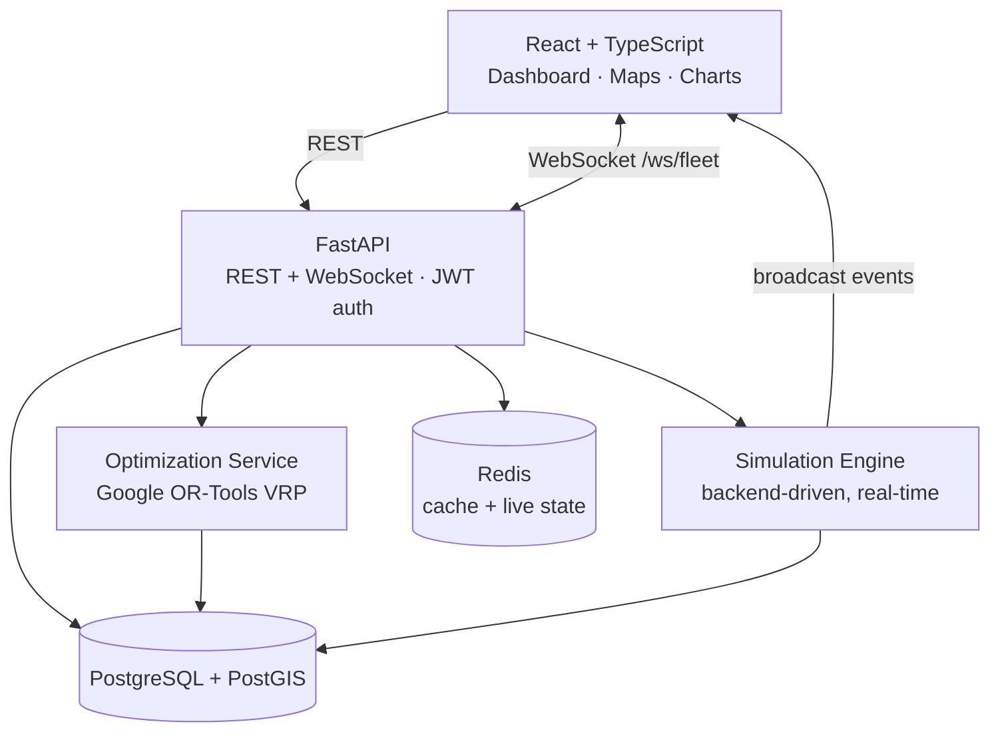

<div align="center">

# 🚚 RouteOS

### Intelligent Logistics & Fleet Optimization Platform

Plan **capacity- and time-window-aware multi-vehicle delivery routes** with a real
Vehicle Routing Problem solver, watch a live fleet move on a map, disrupt it with traffic,
and re-optimize on the fly — all running locally with **one command**.


**No fake data. No dead buttons. Every metric is computed from real routes.**

</div>

---

## ⚡ Run it in 2 minutes

You only need **[Docker Desktop](https://www.docker.com/products/docker-desktop/)** installed and running. That's it — no Python, Node, or database setup.

```bash
git clone <your-repo-url> RouteOS
cd RouteOS
cp .env.example .env        # Windows PowerShell: copy .env.example .env
docker compose up --build
```

Wait ~1–2 minutes for the first build. When the logs say `Application startup complete`, open:

| What | URL |
|---|---|
| 🖥️ **The app** | **http://localhost:5173** |
| 📖 API docs (Swagger) | http://localhost:8000/docs |
| ❤️ Health check | http://localhost:8000/health |

The backend **automatically** waits for the database, runs migrations, and seeds demo data
(1 depot, 20 vehicles, ~150 orders across Delhi NCR). You land on a fully populated app.

### 🔑 Log in with a demo account

| Role | Email | Password | Can do |
|---|---|---|---|
| 🟣 **Dispatcher** *(use this)* | `dispatcher@routeos.dev` | `dispatch12345` | Everything operational |
| 🔴 Admin | `admin@routeos.dev` | `admin12345` | Full access |
| 🔵 Viewer | `viewer@routeos.dev` | `viewer12345` | Read-only |

> The login screen has one-click buttons for each account — no typing needed.

---

## 🎬 The 60-second demo (try this after logging in)

> This exact flow works end-to-end — I verified it against the running stack.

1. **📊 Dashboard** — see live KPIs: 150 orders, 20 vehicles, charts.
2. **✦ Route Planner** — click **“Select 50”** orders → **“Select all vehicles”** → pick **Balanced** → hit **⚙ Optimize Routes**.
   - Real Google OR-Tools runs. You get colored route lines on the map + a **baseline comparison** showing the % distance/vehicle savings.
3. Click **Accept Plan** — routes are saved, orders become `ASSIGNED`.
4. **◉ Live Operations** — set speed **20×** → **▶ Start Simulation**.
   - Vehicles start moving on the map (streamed from the backend over WebSockets). Orders flip `OUT_FOR_DELIVERY → DELIVERED` in real time.
5. Click an active route → hit **severe** traffic → a delay warning appears → click **Reoptimize** → the remaining stops re-sequence live.
6. When a vehicle finishes, it returns to the depot, the route goes `COMPLETED`, and **📈 Analytics** updates.

That's the whole product loop: **plan → optimize → dispatch → track → disrupt → recover.**

---

## 🖼️ Screenshots

_Add images to a `docs/` folder and link them here (e.g. dashboard, route planner with polylines, live map)._

| Route Planner | Live Operations |
|---|---|
| _optimize + baseline comparison_ | _live vehicle movement + traffic_ |

---

## 🧩 What's inside



<details>
<summary><b>✨ Feature list (click to expand)</b></summary>

- **Auth & roles** — JWT login, `ADMIN` / `DISPATCHER` / `VIEWER` permissions, protected routes.
- **Orders / Fleet / Depots** — full CRUD, filtering, search, pagination.
- **Real VRP optimization** — OR-Tools with vehicle capacity, delivery time windows, service time,
  per-vehicle max distance, priority-weighted assignment, 3 objectives (distance / time / balanced).
- **Baseline benchmarking** — measured savings vs a naive nearest-neighbour dispatcher.
- **Accept / Discard workflow** — plans only become active routes when you accept them.
- **Real-time simulation** — the *backend* moves vehicles; the browser only renders truth. Speed 1× / 5× / 20×.
- **Traffic + re-optimization** — disrupt a live route and re-sequence its remaining stops.
- **PostGIS geospatial** — `ST_DWithin` / `ST_Distance` “nearby vehicles/orders” endpoints, spatial indexes.
- **Dashboard & analytics** — SQL-aggregated KPIs and charts, Redis-cached.
- **Observability** — structured JSON logs w/ request IDs, `/health`, Prometheus `/metrics`.

</details>

<details>
<summary><b>🛠️ Tech stack (click to expand)</b></summary>

| Layer | Technologies |
|---|---|
| Frontend | React 18, TypeScript, Vite, Tailwind CSS, TanStack Query, Zustand, Leaflet + OpenStreetMap, Recharts |
| Backend | Python 3.12, FastAPI, SQLAlchemy 2 (async), Pydantic v2, Alembic |
| Data | PostgreSQL 16 + PostGIS 3.4, Redis 7 |
| Optimization | Google OR-Tools (routing/CP), Haversine fallback, optional OSRM |
| Realtime | FastAPI WebSockets, asyncio simulation loop |
| Infra | Docker, Docker Compose, nginx |

</details>

---

## 🩹 Troubleshooting

<details open>
<summary><b>“port is already allocated” (most common)</b></summary>

You already have a local PostgreSQL or Redis using the default ports. RouteOS lets you change the
**host-side** ports without touching anything internal. Edit `.env`:

```env
POSTGRES_HOST_PORT=55432   # any free port
REDIS_HOST_PORT=6380
```
Then `docker compose up` again. (The frontend `5173` and backend `8000` also need to be free.)
</details>

<details>
<summary><b>Docker says it can't connect / daemon not running</b></summary>

Start **Docker Desktop** first and wait until its whale icon is steady, then re-run `docker compose up`.
</details>

<details>
<summary><b>Reset everything (fresh database)</b></summary>

```bash
docker compose down -v      # -v also deletes the seeded DB volume
docker compose up --build
```
</details>

<details>
<summary><b>Generate more demo orders (load testing)</b></summary>

```bash
docker compose exec backend python -m scripts.generate_demo_orders --count 500 --depot 1
```
</details>

---

## 🌐 Want a public live URL?

RouteOS is **local-first** — the fastest way for anyone to try it is the one command above, which
runs the *entire* stack (database + cache + API + UI) on their machine in a couple of minutes.

Want an actual shareable link? This repo ships a **one-click deploy blueprint** for
[Render](https://render.com)'s free tier — it provisions Postgres (PostGIS) + Redis + backend +
frontend from [`render.yaml`](render.yaml):

**➡️ Full step-by-step guide: [DEPLOY.md](DEPLOY.md)**

> Free instances sleep after ~15 min idle and cold-start in ~50s — great for a portfolio demo.
> The same setup also works on **Railway** and **Fly.io**.

---

## 🧪 Tests & benchmarks

```bash
# Backend (real OR-Tools constraint tests + geospatial) — 9 tests
docker compose exec backend python -m pytest -q

# Optimization benchmark vs the naive baseline
docker compose exec backend python -m scripts.benchmark --sizes 50 100 250
```

**Measured** distance reduction vs baseline (synthetic NCR orders, 12 vehicles):

| Orders | Optimized | Baseline | Distance saved | Assigned |
|---:|---:|---:|---:|---:|
| 50 | 261.6 km | 346.8 km | **24.6%** | 50/50 |
| 100 | 375.0 km | 576.4 km | **34.9%** | 100/100 |
| 250 | 786.5 km | 981.3 km | **19.9%** | 250/250 |

> Numbers vary with random seed / hardware / solver time budget.

---

## 📚 Learn more

- **[architecture/ARCHITECTURE.md](architecture/ARCHITECTURE.md)** — full system design, data model,
  real-time flow, and how it would scale from 100 → 1,000,000 deliveries/day.
- **`/docs`** (when running) — interactive Swagger API reference.

---

## ⚠️ Honest limitations

- The fleet movement is a **simulation**, not real GPS (clearly labelled as such).
- Optimization is a **heuristic under a time budget**, not proven-optimal (VRP is NP-hard).
- No AI/ML — the engine is operations-research / constraint optimization.

---

## 📝 Resume line

> Built RouteOS, a full-stack logistics & fleet-optimization platform: constraint-based Vehicle
> Routing (Google OR-Tools) over PostgreSQL/PostGIS, with real-time backend-driven route simulation
> over WebSockets (FastAPI, React/TypeScript, Redis, Docker), and baseline benchmarking that
> quantified ~20–35% reductions in fleet distance.
