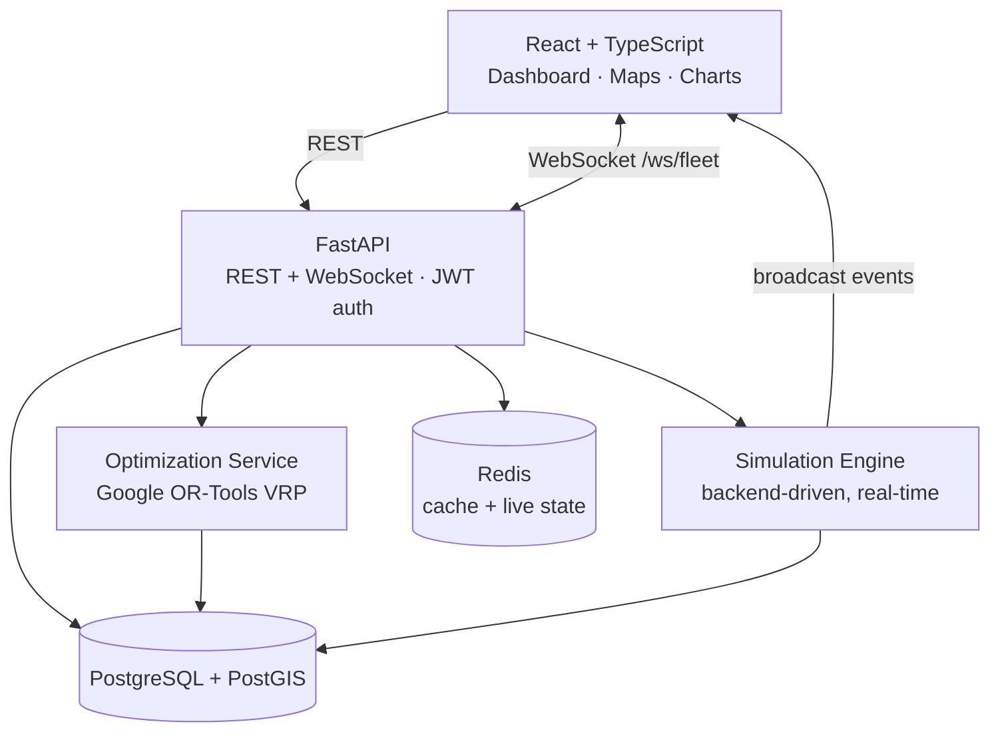

<div align="center">

# RouteOS

**Intelligent Logistics & Fleet Optimization Platform**

A full-stack platform for planning capacity- and time-window-aware multi-vehicle delivery routes
using a constraint-based Vehicle Routing Problem solver, with a live geospatial map, backend-driven
real-time simulation, traffic disruption, and dynamic re-optimization.

[](#)
[](#)
[](#)
[](#)
[](#)
[](#)

[Quick Start](#quick-start) · [Demo Walkthrough](#demo-walkthrough) · [Architecture](#architecture) · [Deployment](#deployment) · [Documentation](architecture/ARCHITECTURE.md)

</div>

---

## Overview

RouteOS assigns delivery orders to vehicles and sequences their stops to minimize total distance,
travel time, and vehicles used, while respecting vehicle capacity, delivery time windows, service
times, and per-vehicle distance limits. Optimized plans are benchmarked against a naive baseline to
quantify the improvement, then dispatched and tracked in real time on an interactive map.

The system is fully functional end to end — frontend, REST/WebSocket API, PostgreSQL/PostGIS,
optimization engine, and simulation are integrated, and every metric shown is computed from live
data rather than hard-coded.

---

## Quick Start

The only prerequisite is [Docker Desktop](https://www.docker.com/products/docker-desktop/). No
local Python, Node, or database installation is required.

```bash
git clone https://github.com/dhanoliya-ji/RouteOS-Intelligent-Logistics-Fleet-Optimization-Platform.git RouteOS
cd RouteOS
cp .env.example .env          # Windows PowerShell: copy .env.example .env
docker compose up --build
```

The backend automatically waits for the database, applies migrations, and seeds demo data
(1 depot, 20 vehicles, ~150 orders across Delhi NCR). When the logs report
`Application startup complete`, the services are available at:

| Service | URL |
|---|---|
| Web application | http://localhost:5173 |
| API documentation (Swagger) | http://localhost:8000/docs |
| Health check | http://localhost:8000/health |
| Metrics (Prometheus) | http://localhost:8000/metrics |

### Demo accounts

| Role | Email | Password |
|---|---|---|
| Dispatcher | `dispatcher@routeos.dev` | `dispatch12345` |
| Admin | `admin@routeos.dev` | `admin12345` |
| Viewer | `viewer@routeos.dev` | `viewer12345` |

The login screen provides one-click sign-in for each account.

---

## Demo Walkthrough

The full product loop — plan, optimize, dispatch, track, disrupt, recover — runs end to end:

1. **Dashboard** — review operational KPIs and charts derived from live data.
2. **Route Planner** — select orders and vehicles, choose an objective, and run the optimizer.
   Google OR-Tools computes the routes and returns a baseline comparison showing the measured
   distance and vehicle savings, rendered as color-coded polylines on the map.
3. **Accept Plan** — persist the plan; orders transition to `ASSIGNED`.
4. **Live Operations** — start the simulation (1×/5×/20×). Vehicles move along their routes,
   streamed from the backend over WebSockets, and orders progress
   `OUT_FOR_DELIVERY → DELIVERED` in real time.
5. **Disruption** — apply traffic to an active route to introduce a delay and surface at-risk
   deliveries, then re-optimize the remaining stops.
6. **Completion** — vehicles return to the depot, routes close as `COMPLETED`, and Analytics
   reflects the delivered volume and optimization savings.

---

## Screenshots

Add images to a `docs/` directory and reference them below.

| Route Planner | Live Operations |
|---|---|
| _Optimization result with baseline comparison_ | _Real-time vehicle tracking and traffic disruption_ |

---

## Architecture



A detailed treatment of the data model, real-time flow, optimization workflow, and scaling strategy
is available in [architecture/ARCHITECTURE.md](architecture/ARCHITECTURE.md).

---

## Features

- **Authentication and authorization** — JWT authentication with `ADMIN`, `DISPATCHER`, and
  `VIEWER` roles enforced on protected routes.
- **Order, fleet, and depot management** — full CRUD with filtering, search, and pagination.
- **Vehicle Routing Problem optimization** — OR-Tools model with vehicle capacity, delivery time
  windows, service time, per-vehicle distance limits, priority-weighted assignment, and three
  objectives (distance, time, balanced).
- **Baseline benchmarking** — measured savings against a nearest-neighbour heuristic.
- **Plan review workflow** — optimization results become active routes only when accepted.
- **Real-time simulation** — the backend is the source of truth for vehicle movement; the client
  renders published events over WebSockets.
- **Traffic and re-optimization** — disrupt a live route and re-sequence its remaining stops.
- **Geospatial queries** — PostGIS `ST_DWithin` / `ST_Distance` proximity endpoints with spatial
  indexes.
- **Dashboard and analytics** — SQL-aggregated KPIs and charts with Redis caching.
- **Observability** — structured JSON logging with request IDs, a health endpoint, and Prometheus
  metrics.

---

## Technology Stack

| Layer | Technologies |
|---|---|
| Frontend | React 18, TypeScript, Vite, Tailwind CSS, TanStack Query, Zustand, Leaflet + OpenStreetMap, Recharts |
| Backend | Python 3.12, FastAPI, SQLAlchemy 2 (async), Pydantic v2, Alembic |
| Data | PostgreSQL 16 + PostGIS 3.4, Redis 7 |
| Optimization | Google OR-Tools, Haversine fallback, optional OSRM routing |
| Real-time | FastAPI WebSockets, asyncio simulation loop |
| Infrastructure | Docker, Docker Compose, nginx |

---

## Testing and Benchmarks

```bash
# Backend test suite (OR-Tools constraint tests + geospatial)
docker compose exec backend python -m pytest -q

# Optimization benchmark against the naive baseline
docker compose exec backend python -m scripts.benchmark --sizes 50 100 250
```

Representative benchmark results (synthetic Delhi NCR orders, 12 vehicles):

| Orders | Optimized | Baseline | Distance Reduction | Assigned |
|---:|---:|---:|---:|---:|
| 50 | 261.6 km | 346.8 km | 24.6% | 50 / 50 |
| 100 | 375.0 km | 576.4 km | 34.9% | 100 / 100 |
| 250 | 786.5 km | 981.3 km | 19.9% | 250 / 250 |

Results vary with random seed, hardware, and solver time budget.

---

## Deployment

RouteOS runs locally with a single command, and includes a [Render](https://render.com) Blueprint
([`render.yaml`](render.yaml)) that provisions PostgreSQL (PostGIS), Redis, the backend API, and the
frontend on a free tier for a shareable public URL. See **[DEPLOY.md](DEPLOY.md)** for step-by-step
instructions. The same configuration also applies to Railway and Fly.io.

---

## Configuration

All configuration is supplied through environment variables; see [`.env.example`](.env.example) for
the full list, including database and Redis URLs, JWT secret, CORS origins, routing parameters
(`USE_OSRM`, `ROAD_DISTANCE_FACTOR`, `AVERAGE_SPEED_KMH`, `SOLVER_TIME_LIMIT_SECONDS`), and demo
credentials. Secrets are never committed; `.env` is git-ignored.

If a local PostgreSQL or Redis already occupies the default ports, override the published host
ports in `.env`:

```env
POSTGRES_HOST_PORT=55432
REDIS_HOST_PORT=6380
```

To reset the environment and reseed the database:

```bash
docker compose down -v
docker compose up --build
```

---

## Design Notes and Limitations

- Fleet movement is a **simulation** for demonstration purposes, not real GPS telemetry.
- Optimization is a **heuristic under a wall-clock time budget** and is not guaranteed optimal;
  the Vehicle Routing Problem is NP-hard.
- The optimization engine is operations-research / constraint optimization, not machine learning.

---

## License

Released under the MIT License.
