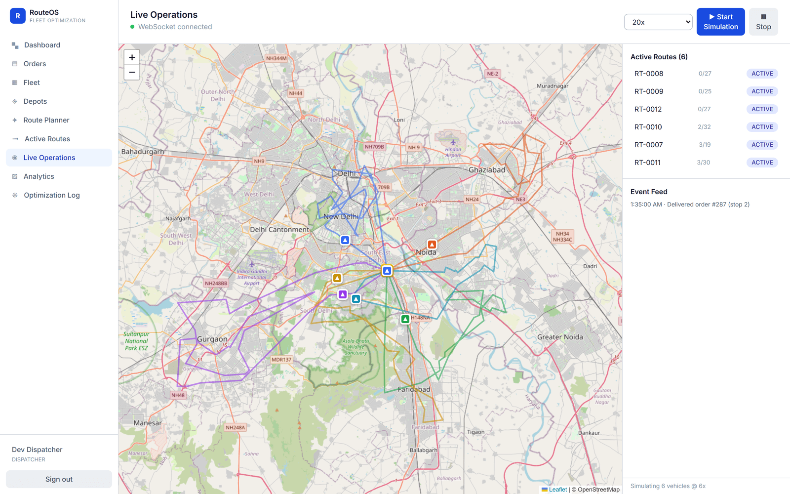
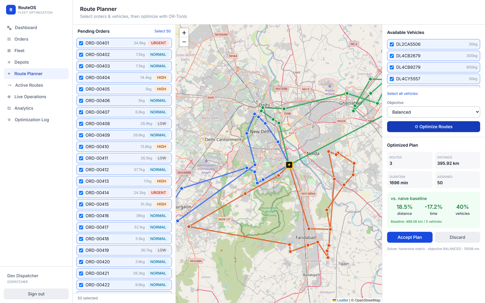
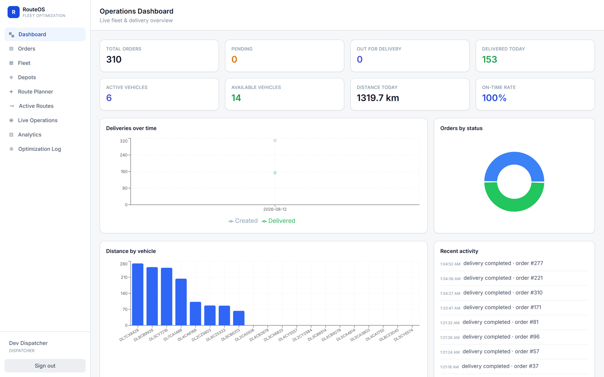
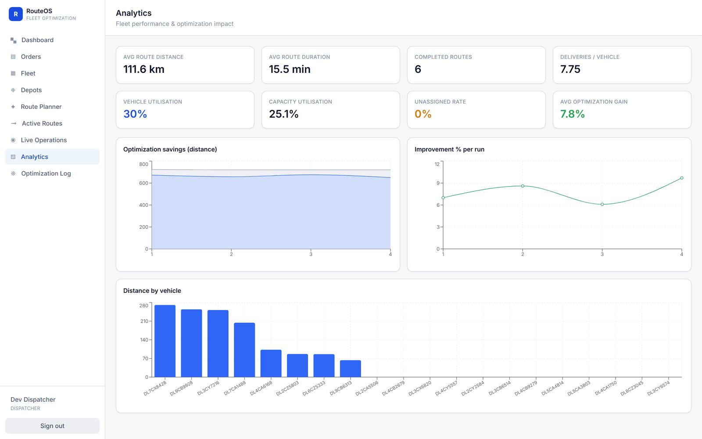
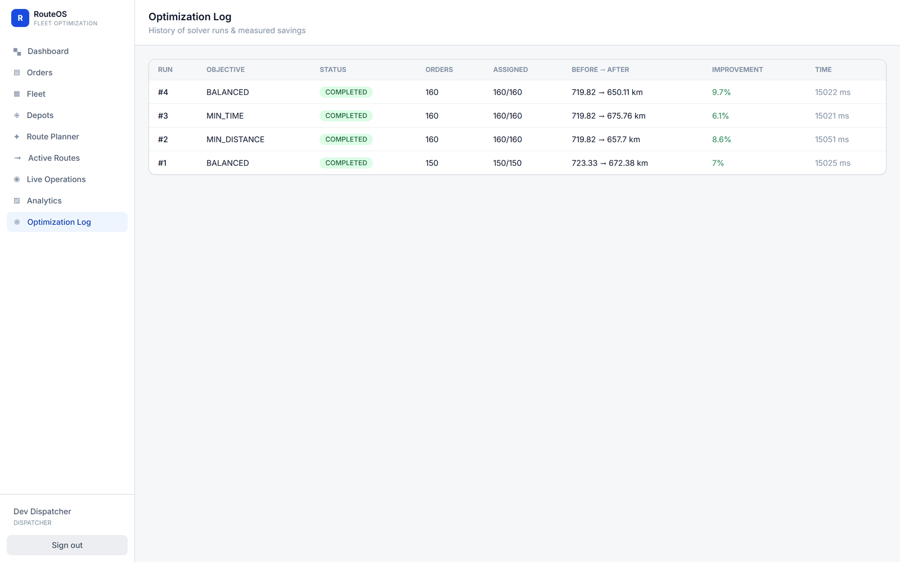
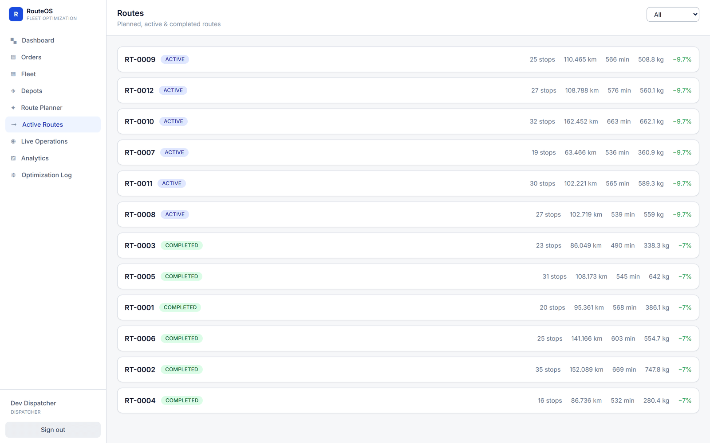
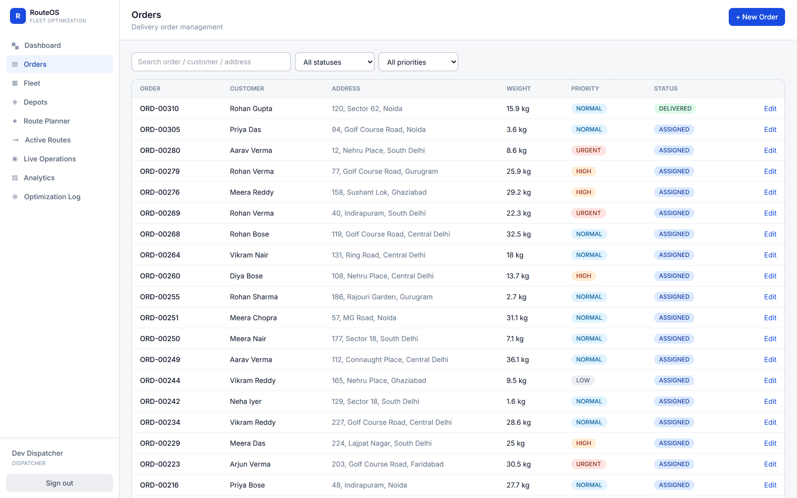
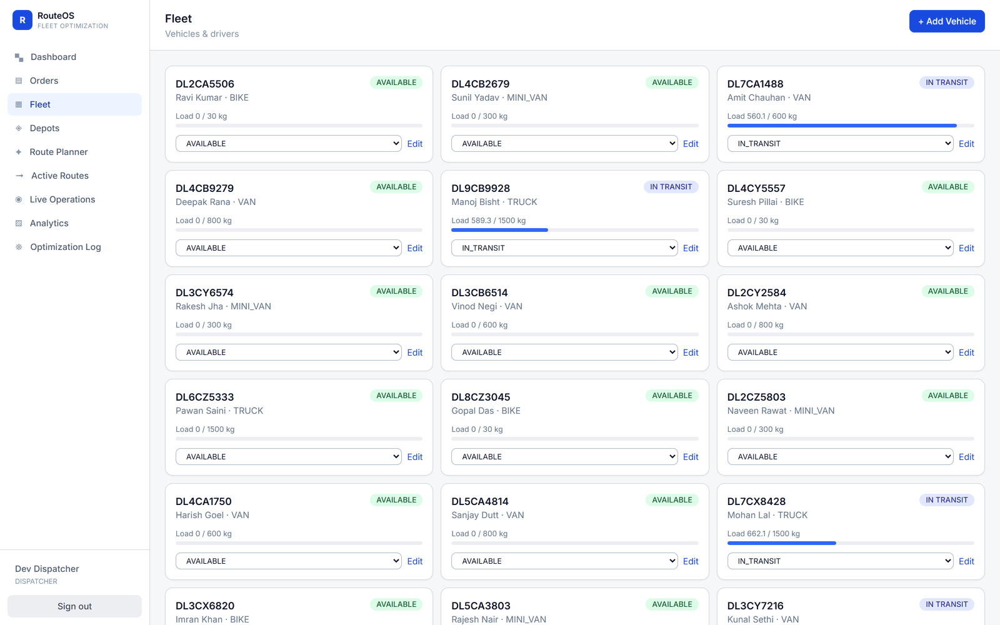
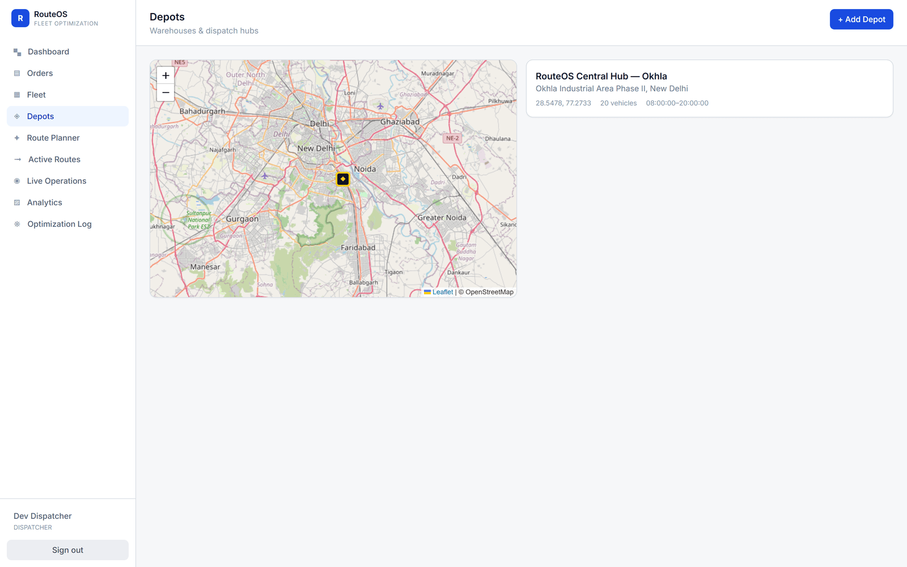
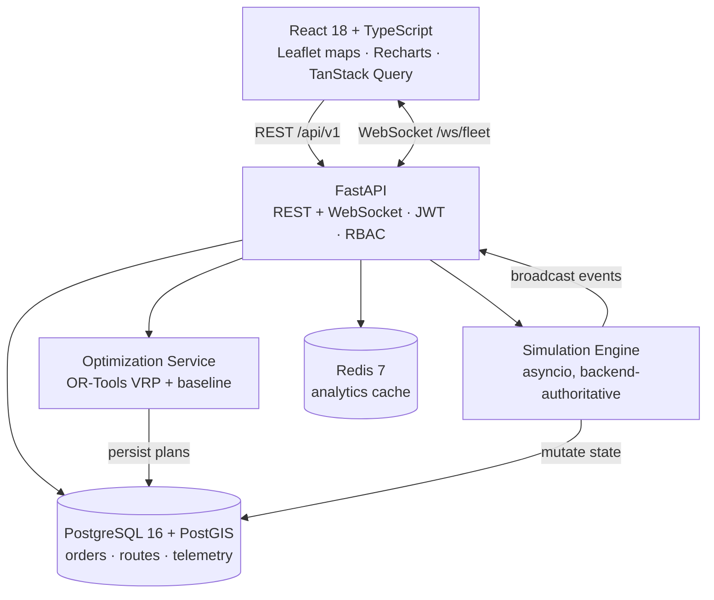

<div align="center">



# RouteOS

### Intelligent Logistics & Fleet Optimization Platform

Plan capacity- and time-window-aware multi-vehicle delivery routes with a constraint solver,
dispatch them, and watch the fleet move in real time — with traffic disruption and live
re-optimization built in.

[](#)
[](#)
[](#)
[](#)
[](#)
[](#)
[](#)
[](LICENSE)

### [▶ Live Demo](https://routeos-frontend.onrender.com) · [API Docs](https://routeos-backend-h5x6.onrender.com/docs) · [Health](https://routeos-backend-h5x6.onrender.com/health)

Sign in as **`dispatcher@routeos.dev`** / **`dispatch12345`** (one-click on the login screen).

> Hosted on Render's free tier: the first request after ~15 min idle cold-starts in ~50s, and the
> instance gets a fraction of a CPU — see [a note on the live demo's solver
> quality](#a-note-on-the-live-demo). For full-speed results, run it locally with one command.

**[Quick Start](#-quick-start)** ·
**[Screenshots](#-screenshots)** ·
**[How It Works](#-how-it-works)** ·
**[Benchmarks](#-benchmarks)** ·
**[Architecture](#-architecture)** ·
**[API](#-api-reference)** ·
**[Deploy](#-deployment)**

</div>

---

## What is RouteOS?

Every delivery business faces the same question each morning: *given N orders and M vehicles,
who delivers what, in what order?* Answer it badly and you burn fuel, miss delivery windows, and
pay for trucks you didn't need.

RouteOS answers it with a **constraint-based Vehicle Routing Problem (VRP) solver**, then runs the
whole operational loop around that answer:

```
Orders + Fleet  →  Optimize (OR-Tools)  →  Review vs baseline  →  Dispatch
                                                                      ↓
              Analytics  ←  Complete  ←  Re-optimize  ←  Traffic hits  ←  Live tracking
```

Every number in the UI — distances, savings, ETAs, utilisation — is **computed from live data**.
Nothing is hard-coded or mocked.

### What makes it non-trivial

| | |
|---|---|
| **Real constraint model** | Capacity, delivery time windows, per-stop service durations, per-vehicle distance caps, and priority-weighted drop penalties — solved simultaneously, not greedily. |
| **Honest benchmarking** | Every plan is solved twice: once with OR-Tools, once with a naive nearest-neighbour heuristic. The UI shows the measured delta, including when the tradeoff is unfavourable. |
| **Backend-authoritative simulation** | Vehicle movement is computed server-side against real database state and streamed over WebSockets. The client renders events; it never invents motion. |
| **Genuine geospatial** | PostGIS `geography` columns with `ST_DWithin` / `ST_Distance` radius search — not latitude/longitude arithmetic in Python. |
| **Recovery, not just planning** | Inject traffic on a live route, see which deliveries go at-risk, then re-sequence only the *undelivered* stops from the vehicle's current position. |

---

## 🚀 Quick Start

The only prerequisite is [Docker Desktop](https://www.docker.com/products/docker-desktop/).
No local Python, Node, or database needed.

```bash
git clone https://github.com/dhanoliya-ji/RouteOS.git
cd RouteOS
cp .env.example .env          # Windows PowerShell: copy .env.example .env
docker compose up --build
```

The backend waits for Postgres, applies migrations, enables PostGIS, and seeds demo data
(1 depot, 20 vehicles, ~150 orders across Delhi NCR). When you see
`Application startup complete`:

| Service | URL |
|---|---|
| **Web application** | http://localhost:5173 |
| API docs (Swagger) | http://localhost:8000/docs |
| Health check | http://localhost:8000/health |
| Metrics (Prometheus) | http://localhost:8000/metrics |

### Demo accounts

| Role | Email | Password | Can do |
|---|---|---|---|
| **Dispatcher** | `dispatcher@routeos.dev` | `dispatch12345` | Everything operational — optimize, dispatch, simulate |
| Admin | `admin@routeos.dev` | `admin12345` | Dispatcher + user management |
| Viewer | `viewer@routeos.dev` | `viewer12345` | Read-only |

The login screen has one-click sign-in for each. **Start with Dispatcher.**

> **Port already in use?** If you already run Postgres or Redis locally, override the published
> host ports in `.env` — `POSTGRES_HOST_PORT=55432` and `REDIS_HOST_PORT=56379`.

---

## 🎬 Try It in 3 Minutes

1. **Sign in** as Dispatcher → land on the **Dashboard** (live KPIs).
2. **Route Planner** → click *Select 50* → *Select all vehicles* → **Optimize Routes**.
   Wait ~15s (the solver's wall-clock budget). You get color-coded routes on the map and a
   measured comparison against the naive baseline.
3. **Accept Plan** → orders become `ASSIGNED`, routes go `PLANNED`.
4. **Live Operations** → pick a speed (1×/5×/20×) → **Start Simulation**.
   Vehicles move; the event feed streams deliveries as they happen.
5. **Break it** → apply **severe traffic** to an active route. You'll get an estimated delay and a
   list of deliveries now at risk of missing their window.
6. **Fix it** → **Re-optimize** that route. Only the undelivered stops are re-sequenced, starting
   from where the vehicle actually is. The running simulation picks up the new plan on its next tick.
7. **Analytics** → savings, utilisation, and per-run improvement trends.

---

## 📸 Screenshots

### Route Planner — optimization result vs naive baseline
Selected orders and fleet on the left, solved routes on the map, measured savings on the right.
Here: **3 routes instead of 5 vehicles (−40%)** and **395.92 km vs 486.06 km (−18.5%)** — while
serving all 50 orders. Note the honestly-reported **−17.2% on time**: consolidating onto fewer
vehicles makes each route longer in duration. The solver shows the tradeoff instead of hiding it.



### Live Operations — real-time fleet tracking
Six active routes streaming over a WebSocket, live vehicle markers, per-route stop progress,
and a delivery event feed. Traffic injection and re-optimization are driven from this screen.


### Operations Dashboard
KPIs and charts aggregated in SQL and cached in Redis.



### Analytics — optimization impact over time
Per-run improvement, distance savings, fleet utilisation, and distance by vehicle.



### Optimization Log — every solver run, audited
Objective, order counts, before → after distance, measured improvement, and solve time.



### Routes, Orders & Fleet

| Routes | Orders |
|---|---|
|  |  |

| Fleet | Depots |
|---|---|
|  |  |

---

## 🧠 How It Works

### The optimization model

The solver ([`backend/app/optimization/solver.py`](backend/app/optimization/solver.py)) builds an
OR-Tools routing model where node `0` is the depot and nodes `1..n` are orders:

| Component | Implementation |
|---|---|
| **Arc cost** | Distance, travel time, or a blended metric, depending on the chosen objective |
| **Capacity** | `AddDimensionWithVehicleCapacity` against each vehicle's `capacity_kg` |
| **Distance cap** | A `Distance` dimension with a per-vehicle max on the route's end cumulative value |
| **Time windows** | A `Time` dimension carrying travel + service time; each order's `CumulVar` is constrained to its delivery window (waiting allowed) |
| **Priority** | Orders are optional via `AddDisjunction` with a **priority-scaled drop penalty**, so urgent orders are the last thing sacrificed |
| **Fleet consolidation** | A fixed cost per used vehicle pushes the solver to use fewer trucks |
| **Search** | `PATH_CHEAPEST_ARC` first solution, then `GUIDED_LOCAL_SEARCH` under a wall-clock budget |

Three objectives are available: `MIN_DISTANCE`, `MIN_TIME`, and `BALANCED`.

Unserved orders are never silently dropped — they're returned with a diagnosed reason
(`CAPACITY_EXCEEDED`, `TIME_WINDOW_INFEASIBLE`, `NO_AVAILABLE_VEHICLE`).

> **Note on time windows:** the planning horizon is anchored at the *earliest* delivery window in
> the batch, so windows are handled as relative offsets. Plans stay valid regardless of the
> absolute calendar date of the data.

### The baseline comparison

To claim a saving you need something to compare against. Every optimization run also solves the
same problem with a **greedy nearest-neighbour heuristic** — hop to the nearest unserved order that
still fits remaining capacity and distance budget, then return to depot. That mimics a dispatcher
routing by hand.

Both results are reported with their **assigned-order counts**, so the comparison stays
apples-to-apples: a baseline that quietly serves fewer orders can't fake a shorter distance.

**The better of the two is what gets dispatched.** A time-budgeted heuristic can stop while still
behind greedy — on a small instance with little CPU, that genuinely happens. Shipping that plan
would mean dispatching routes a human router would have beaten, so the service ranks both plans
using the same distance/vehicle trade-off the solver's own objective encodes (one vehicle ≈ 300 km)
and keeps the winner. Serving more orders always wins over being cheaper. Every run records a
`plan_source` of `solver` or `baseline`, and the UI says so explicitly rather than quietly showing
a 0% gain.

#### A note on the live demo

The hosted demo runs on a free instance with roughly **1/15th of a local CPU core**. The solver's
budget is wall-clock, so it completes far fewer guided-local-search iterations there. Measured on
the same 150-order dataset:

| Orders | CPU budget | Result vs baseline |
|---:|---:|---:|
| 50 | ~3 CPU-s | **+20.7%** |
| 80 | ~3 CPU-s | **+10.2%** |
| 150 | ~3 CPU-s | −0.9% → **dispatches baseline instead (0%)** |
| 150 | 15 CPU-s | **+7.0%**, and 6 vehicles instead of 7 |

So on the live demo, **use the planner's *Select 50*** (the documented walkthrough) to see the
optimizer at its best. Asking it to solve all 150 orders at once on free-tier hardware is where it
runs out of search budget — and the app tells you when that happens instead of pretending.
Locally, the full 150-order run converges to +7% in 15 seconds.

### The simulation engine

A single asyncio loop ([`backend/app/simulation/engine.py`](backend/app/simulation/engine.py))
ticks once per second and, for each active vehicle:

1. Advances it along its route polyline by `speed × traffic_factor × tick`.
2. On reaching a stop — marks the order `DELIVERED`, timestamps the arrival, writes a
   `DeliveryEvent`, and broadcasts it.
3. Snapshots position into `vehicle_location_history` roughly every 300 m.
4. On returning to the depot — closes the route as `COMPLETED` and frees the vehicle.

Traffic severity maps to a speed factor (`clear 1.0`, `moderate 0.6`, `severe 0.35`,
`breakdown 0.0`). Re-optimization rewrites only `PENDING` stops and the engine reloads that route
on its next tick — completed stops are preserved.

---

## 📊 Benchmarks

Reproduce these yourself:

```bash
docker compose exec backend python -m scripts.benchmark --sizes 50 100 250 --vehicles 12
```

Synthetic Delhi NCR orders, 12 uniform vehicles (600 kg, 250 km cap), 15s solver budget:

| Orders | Optimized | Naive baseline | Distance reduction | Orders assigned |
|---:|---:|---:|---:|---:|
| 50 | **261.6 km** | 346.8 km | **24.6%** | 50 / 50 |
| 100 | **375.0 km** | 576.4 km | **34.9%** | 100 / 100 |
| 250 | **771.0 km** | 981.3 km | **21.4%** | 250 / 250 |

**20–35% less distance with 100% order assignment**, measured — not estimated.

### On the seeded demo dataset

The bundled demo fleet is deliberately *heterogeneous* (30 kg bikes through 1500 kg trucks) with
tight delivery windows, which is a harder and more realistic problem. There the gain shows up
differently — a live run over 160 orders:

| Metric | Naive baseline | RouteOS | Delta |
|---|---:|---:|---:|
| Total distance | 719.82 km | **650.11 km** | **−9.7%** |
| Vehicles used | 10 | **6** | **−40%** |
| Orders assigned | 160 / 160 | 160 / 160 | — |

Fewer vehicles *and* fewer kilometres. Numbers vary with seed, hardware, and solver budget.

---

## 🏗 Architecture



The heavy OR-Tools solve runs in a worker thread (`asyncio.to_thread`) so the API stays responsive
while a plan is being computed.

Deeper treatment of the data model, real-time flow, and scaling strategy:
**[architecture/ARCHITECTURE.md](architecture/ARCHITECTURE.md)**.

### Project structure

```
RouteOS/
├── backend/
│   ├── app/
│   │   ├── api/routes/        # FastAPI routers (auth, orders, fleet, optimization, simulation, ws)
│   │   ├── core/              # config, security, logging, redis, metrics, errors
│   │   ├── db/                # async engine + session
│   │   ├── geospatial/        # PostGIS helpers, haversine/road distance
│   │   ├── models/            # SQLAlchemy ORM
│   │   ├── optimization/      # OR-Tools solver, nearest-neighbour baseline, distance matrix
│   │   ├── schemas/           # Pydantic v2 request/response models
│   │   ├── services/          # business logic
│   │   ├── simulation/        # asyncio movement engine
│   │   └── websocket/         # connection manager + broadcast
│   ├── alembic/               # migrations (incl. CREATE EXTENSION postgis)
│   ├── scripts/               # seed, demo order generator, benchmark harness
│   └── tests/                 # pytest suite
├── frontend/
│   └── src/
│       ├── api/               # typed client + endpoints
│       ├── components/        # layout + UI primitives
│       ├── hooks/             # useFleetSocket (WebSocket)
│       ├── pages/             # Dashboard, Planner, LiveOps, Analytics, …
│       └── stores/            # Zustand (auth, toasts)
├── docker-compose.yml         # postgres + redis + backend + frontend
└── render.yaml                # one-click free-tier cloud deploy
```

---

## ✨ Features

**Optimization**
- OR-Tools CVRP with time windows, service durations, per-vehicle distance limits
- Priority-weighted assignment (`LOW` → `URGENT`) via scaled drop penalties
- Three objectives: minimize distance, minimize time, or balanced
- Nearest-neighbour baseline comparison on every run
- Plan review workflow — results become live routes only when explicitly accepted
- Full audit log of every solver run with measured savings

**Real-time operations**
- Backend-authoritative simulation with adjustable speed (1×–60×)
- WebSocket event stream: vehicle positions, deliveries, route/order status changes
- Traffic disruption injection with at-risk delivery detection
- Dynamic stop re-sequencing of remaining stops from the vehicle's live position

**Platform**
- JWT auth with `ADMIN` / `DISPATCHER` / `VIEWER` role enforcement
- Order, fleet, and depot CRUD with filtering, search, and pagination
- PostGIS proximity endpoints (`/orders/nearby`, `/vehicles/nearby`) using `ST_DWithin`
- SQL-aggregated dashboard and analytics, Redis-cached with explicit invalidation
- Structured JSON logging with request IDs, health endpoint, Prometheus metrics
- Fully containerized; migrations and seeding run automatically on boot

---

## 🔌 API Reference

Interactive docs at `/docs` when running. Highlights:

| Method | Endpoint | Purpose |
|---|---|---|
| `POST` | `/api/v1/auth/login` | OAuth2 form login → JWT |
| `GET` | `/api/v1/auth/me` | Current user |
| `GET` | `/api/v1/orders` | List orders (filter, search, paginate) |
| `GET` | `/api/v1/orders/nearby` | **PostGIS** radius search, sorted by true distance |
| `GET` | `/api/v1/vehicles/nearby` | **PostGIS** radius search over the fleet |
| `POST` | `/api/v1/optimization/run` | **Run the VRP solver** + baseline comparison |
| `GET` | `/api/v1/optimization/runs` | Solver run history |
| `POST` | `/api/v1/optimization/runs/{id}/accept` | Turn a plan into live routes |
| `POST` | `/api/v1/optimization/runs/{id}/discard` | Throw the plan away |
| `POST` | `/api/v1/simulation/start` | Start live simulation |
| `POST` | `/api/v1/simulation/traffic` | **Inject a traffic disruption** |
| `POST` | `/api/v1/simulation/routes/{id}/reoptimize` | **Re-sequence remaining stops** |
| `GET` | `/api/v1/analytics/summary` | Fleet + optimization KPIs |
| `WS` | `/ws/fleet` | Live event stream |

<details>
<summary><b>Example — optimize, then dispatch</b></summary>

```bash
# 1. Authenticate (OAuth2 form encoding, not JSON)
TOKEN=$(curl -s -X POST http://localhost:8000/api/v1/auth/login \
  -d "username=dispatcher@routeos.dev&password=dispatch12345" | jq -r .access_token)

# 2. Solve — omit order_ids/vehicle_ids to use everything available
curl -s -X POST http://localhost:8000/api/v1/optimization/run \
  -H "Authorization: Bearer $TOKEN" -H "Content-Type: application/json" \
  -d '{"depot_id":1,"objective":"BALANCED"}' | jq '{
        id, assigned_count, unassigned_count,
        before: .total_distance_before, after: .total_distance_after,
        improvement: .improvement_percentage }'

# 3. Accept the plan -> creates live routes
curl -s -X POST http://localhost:8000/api/v1/optimization/runs/1/accept \
  -H "Authorization: Bearer $TOKEN" | jq '.[].route_code'

# 4. Roll the fleet
curl -s -X POST http://localhost:8000/api/v1/simulation/start \
  -H "Authorization: Bearer $TOKEN" -H "Content-Type: application/json" \
  -d '{"speed_multiplier":10}'
```

</details>

---

## 🧪 Testing

```bash
docker compose exec backend python -m pytest -q          # unit + integration suite
docker compose exec backend python -m scripts.benchmark  # solver benchmark
cd frontend && npx tsc --noEmit                          # frontend type check
```

Coverage includes OR-Tools constraint enforcement (capacity, time windows, distance caps),
geospatial distance math, the baseline heuristic, and deployment-critical config normalization.

---

## 🌐 Deployment

A [Render](https://render.com) Blueprint ([`render.yaml`](render.yaml)) provisions **PostgreSQL
(PostGIS) + Redis + backend + frontend** on the free tier:

1. Push this repo to GitHub.
2. On Render: **New → Blueprint** → select the repo → **Apply**.
3. Open the frontend URL and sign in as Dispatcher.

Every cross-service URL is wired with `fromService`, so the blueprint works **unchanged even if
Render appends a suffix** to a service name — nothing needs hand-editing. The backend expands a
scheme-less hostname into a proper CORS origin, and the frontend derives `https://` / `wss://`
from the injected backend host.

Step-by-step guide, including Railway and Fly.io notes: **[DEPLOY.md](DEPLOY.md)**.

> Free-tier web services sleep after ~15 min idle and cold-start in ~50s. Give the first request
> a moment.

---

## ⚙️ Configuration

All configuration is environment-driven — see [`.env.example`](.env.example). Notable knobs:

| Variable | Default | Meaning |
|---|---|---|
| `SOLVER_TIME_LIMIT_SECONDS` | `15` | Wall-clock budget per optimization run. Raise it on slow/shared CPUs — the budget is wall-clock, not CPU-time |
| `SOLVER_FIRST_SOLUTION_STRATEGY` | `PATH_CHEAPEST_ARC` | OR-Tools first-solution heuristic. Dominates the result when the local search gets few iterations |
| `ROAD_DISTANCE_FACTOR` | `1.25` | Multiplier converting straight-line to road distance |
| `AVERAGE_SPEED_KMH` | `30` | Urban speed used for travel-time estimates |
| `USE_OSRM` | `false` | Use a real OSRM routing matrix instead of the haversine fallback |
| `BACKEND_CORS_ORIGINS` | localhost | Comma-separated; bare hostnames are expanded to `https://` |

`DATABASE_URL` accepts the standard `postgres://` string managed hosts hand out — the app derives
both the async (`asyncpg`) and sync (`psycopg`, for Alembic) drivers itself.

Secrets are never committed; `.env` is git-ignored.

**Reset everything and reseed:**

```bash
docker compose down -v && docker compose up --build
```

---

## 📐 Design Notes & Limitations

Stated plainly, because a portfolio project should be honest about its edges:

- Fleet movement is a **simulation**, not real GPS telemetry. The engine is backend-authoritative
  and mutates real database state, but the vehicles aren't real.
- VRP is **NP-hard**. This is a heuristic under a wall-clock budget — high-quality feasible routes,
  not proven optima. Because the budget is wall-clock rather than CPU-time, **solution quality
  depends on the hardware it runs on**; on a starved instance the solver can fail to beat greedy,
  which is why the service dispatches whichever plan actually wins and labels it.
- Distances default to **haversine × a road factor**. Set `USE_OSRM=true` for a real road-network
  matrix (the public OSRM demo server is rate-limited; the app falls back automatically).
- The optimizer is **operations research / constraint programming**, not machine learning.
- Route polylines are drawn stop-to-stop, so they don't trace actual streets unless OSRM is on.

---

## 🛠 Technology Stack

| Layer | Technologies |
|---|---|
| **Frontend** | React 18, TypeScript, Vite, Tailwind CSS, TanStack Query, Zustand, Leaflet + OpenStreetMap, Recharts |
| **Backend** | Python 3.12, FastAPI, SQLAlchemy 2 (async), Pydantic v2, Alembic |
| **Data** | PostgreSQL 16 + PostGIS 3.4, Redis 7 |
| **Optimization** | Google OR-Tools, haversine fallback, optional OSRM |
| **Real-time** | FastAPI WebSockets, asyncio simulation loop |
| **Infrastructure** | Docker, Docker Compose, nginx, Render Blueprint |

---

## 📄 License

Released under the [MIT License](LICENSE).

<div align="center">

**Built to demonstrate constraint optimization, real-time systems, and geospatial engineering
in one production-shaped application.**

</div>
