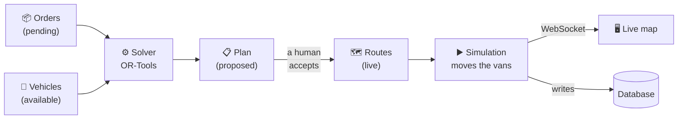

# Start here

New to this codebase? Read this page, then stop. It is the only document that
tries to orient you — everything else is reference, and there is a lot of it.

**Do not read all 27 folder READMEs.** They exist so that when you open a
folder, that folder explains itself. They are not a reading list.

---

## RouteOS in one paragraph

A delivery company has orders to deliver and a fleet of vans. RouteOS decides
**which van delivers which orders, in what sequence** — then shows the fleet
driving those routes on a live map. The deciding is a real optimization problem
solved with Google OR-Tools; the driving is a backend simulation, because there
are no real vans.

---

## The 2-minute version



Five things that explain most of the design:

1. **Solving changes nothing.** A solve produces a *proposal*. Routes only
   become real when a dispatcher clicks Accept. That is why the plan is stored
   as JSON and replayed on accept rather than re-solved.
2. **The solver is a heuristic on a clock**, so it can lose to a dumb greedy
   algorithm. RouteOS therefore runs **both** every time and dispatches the
   winner. `plan_source: "baseline"` in a result means greedy won.
3. **The backend owns movement.** The browser never animates a van; it draws
   the coordinates it is sent. So the map, the order table and the analytics
   can never disagree.
4. **Optimization is a background job**, not a request. A good solve wants
   minutes; an HTTP request should not be held open that long.
5. **The improvement percentage is measured, not claimed.** The greedy baseline
   is computed on every run, so "23% better" always has something real behind
   it.

---

## The 15-minute version

Read these five files, in this order. They are the ones that carry the actual
ideas — the other ~95 source files are plumbing around them.

| # | File | Why this one |
|---|---|---|
| 1 | [`backend/app/optimization/README.md`](backend/app/optimization/README.md) | What the problem *is* (a CVRPTW), why it is hard, and how it is attacked. Start here even if you never read the solver code. |
| 2 | [`backend/app/optimization/solver.py`](backend/app/optimization/solver.py) | The model, built in eight labelled steps. You do not write the search — you declare the rules. |
| 3 | [`backend/app/services/optimization_service.py`](backend/app/services/optimization_service.py) | The workflow around the solve: load, solve twice, keep the winner, store, then accept or discard. |
| 4 | [`backend/app/simulation/engine.py`](backend/app/simulation/engine.py) | One `asyncio` loop, one tick per second, moving every van and writing real database state. |
| 5 | [`frontend/src/pages/RoutePlanner.tsx`](frontend/src/pages/RoutePlanner.tsx) | The whole workflow as a user experiences it: pick, solve, review, accept. |

Every one of them opens with a comment explaining what it does and why.

---

## Then run it

```bash
docker compose up          # from the repo root
```

Open <http://localhost:5173> and sign in as
`dispatcher@routeos.dev` / `dispatch12345`.

Then: **Route Planner** → *Select 50* → *Select all vehicles* → **Optimize** →
**Accept Plan** → **Live Operations** → **Start Simulation**. That is the entire
product in about a minute.

If it does not come up, see
[`docs/TROUBLESHOOTING.md`](docs/TROUBLESHOOTING.md) — the most common cause is
a port clash with a Postgres you already have running.

---

## Where to go next

Pick by what you are trying to do. You will not need most of this.

| I want to… | Read |
|---|---|
| understand a term I keep seeing | [`GLOSSARY.md`](GLOSSARY.md) |
| follow one click through the whole stack | [`architecture/END-TO-END.md`](architecture/END-TO-END.md) |
| see the backend's flows and state machines | [`architecture/BACKEND-FLOWS.md`](architecture/BACKEND-FLOWS.md) |
| change something | [`docs/HOW-TO.md`](docs/HOW-TO.md) |
| know how it would scale | [`architecture/ARCHITECTURE.md`](architecture/ARCHITECTURE.md) |
| work on the backend | [`backend/README.md`](backend/README.md) |
| work on the frontend | [`frontend/README.md`](frontend/README.md) |
| see the feature list, screenshots, benchmarks | [`README.md`](README.md) |

---

## The shape of the repository

```
RouteOS/
├── START-HERE.md         ← you are here
├── GLOSSARY.md           the vocabulary
├── README.md             the showcase: demo links, screenshots, benchmarks
│
├── backend/              FastAPI. The API, the solver, the simulation.
│   └── app/
│       ├── api/          endpoints — thin: validate, authorize, delegate
│       ├── services/     the business rules
│       ├── optimization/ the solver and the greedy baseline
│       ├── simulation/   the movement clock
│       ├── models/       the database tables
│       └── core/         config, logging, errors, auth, cache
│
├── frontend/             React. Ten screens over the API.
│   └── src/
│       ├── pages/        one file per screen
│       ├── api/          the only place fetch() is called
│       └── stores/       who is signed in; the toast queue
│
├── architecture/         the diagrams and the reasoning
├── docs/                 how-to recipes, troubleshooting, screenshots
└── aws/                  deployment
```

Each of those folders has a `README.md` that explains itself when you open it.

---

## Two honest warnings

- **The backend has tests; the frontend has none.** `cd backend && pytest` is
  108 tests — the algorithms, auth, the permission matrix, and the order and
  optimization APIs. 50 of them need a PostGIS test database and **skip**
  without one, so check the skip count before trusting a green run. The
  simulation engine, the WebSocket and the whole UI remain untested; a
  typecheck is the frontend's entire safety net.
- **Some numbers are approximations, and say so.** Distances are straight-line
  × 1.25 unless OSRM is enabled; vehicles travel in straight lines, not along
  roads. Where a figure is a simplification, the code comment next to it says
  so rather than pretending otherwise.
