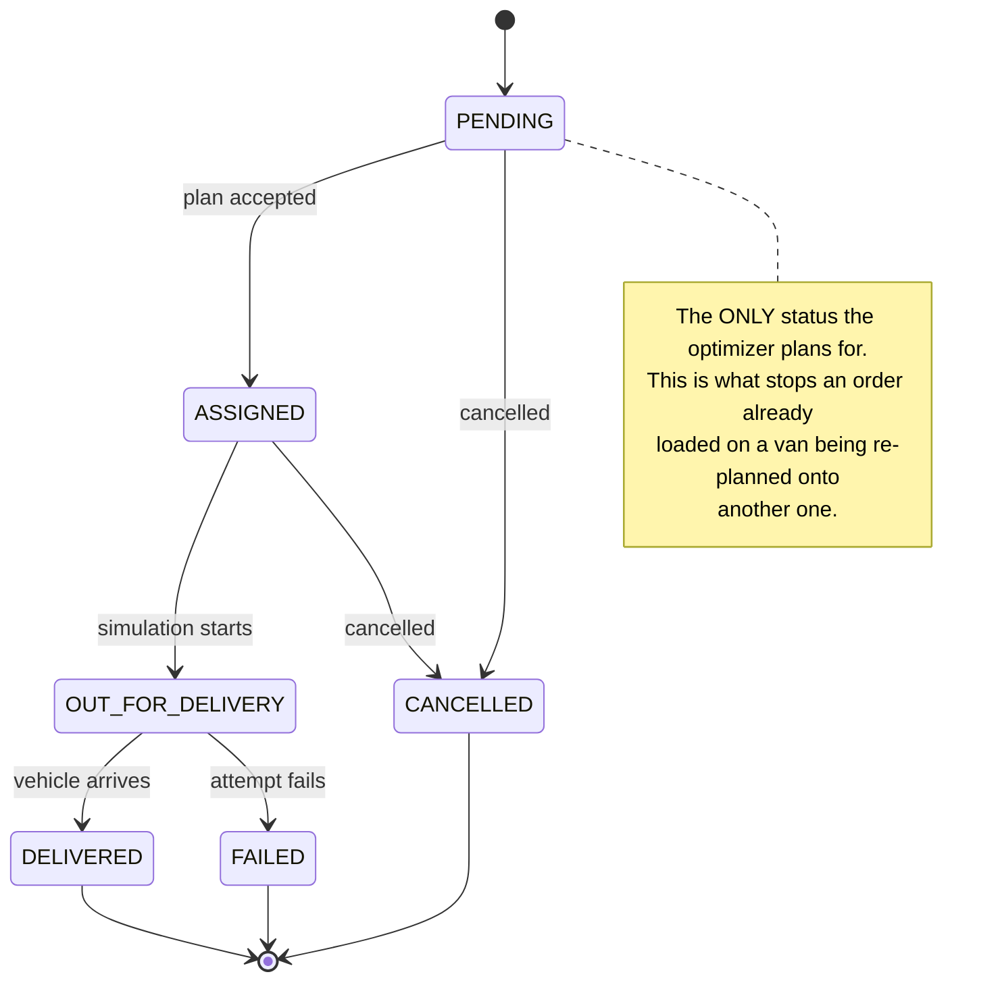
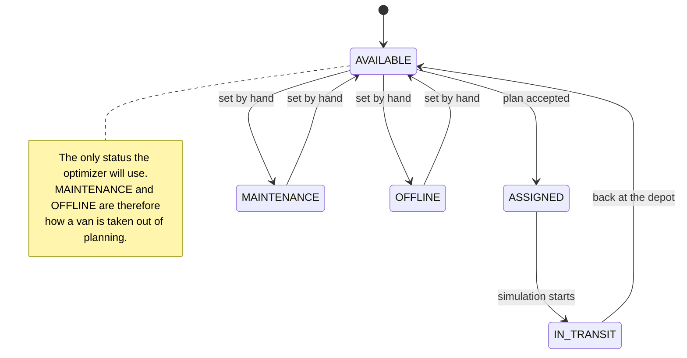
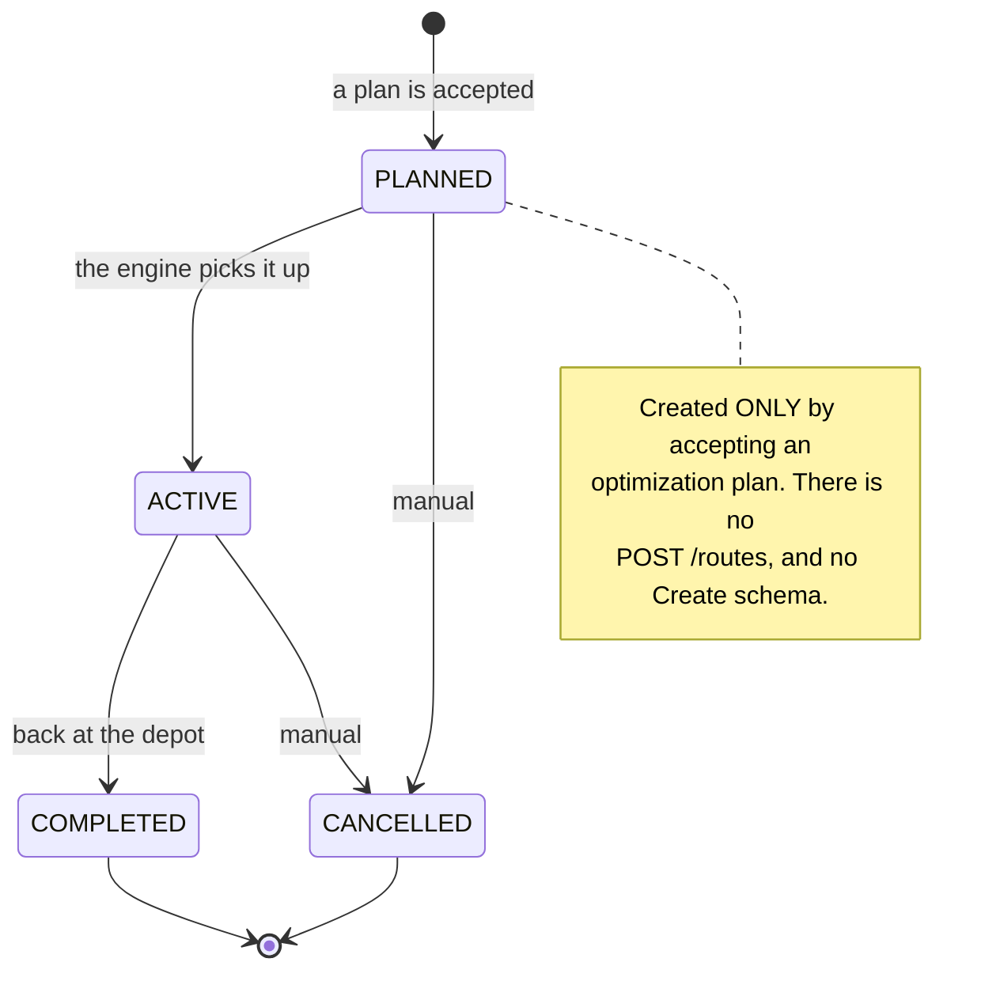
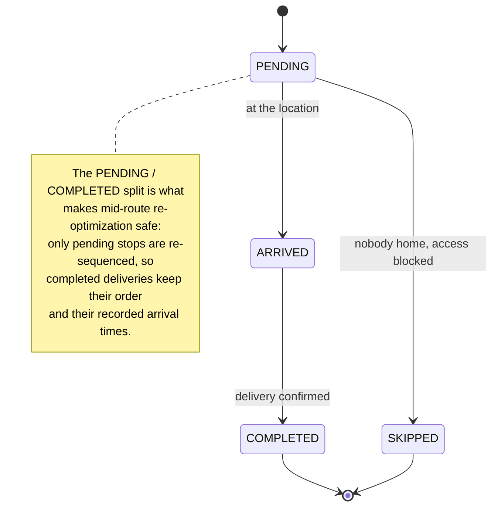
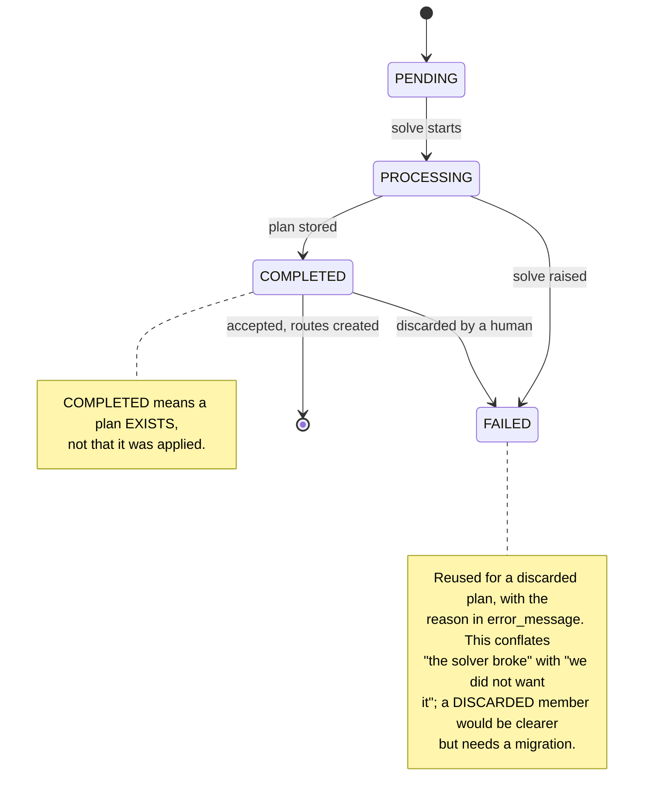

# RouteOS backend — flows and structures

Diagrams for the things that span several files, and so cannot be seen by
reading any one of them.

Companion documents:

| Document | Answers |
|---|---|
| [ARCHITECTURE.md](ARCHITECTURE.md) | how would this scale to a million deliveries a day? |
| **this file** | what happens, in what order, across which files? |
| [../backend/README.md](../backend/README.md) | what is the backend, and how do I run it? |
| [../backend/app/README.md](../backend/app/README.md) | which package may import which? |

Every folder under `backend/` also has its own README covering its files.

---

## 1. Component map

Who talks to whom. Solid lines are calls, dashed lines are events.

```
                          ┌──────────────┐
                          │   Browser    │
                          └──┬────────┬──┘
                     REST    │        │   WebSocket
                             ▼        ▲
   ┌─────────────────────────────────────────────────────────────────┐
   │                      FastAPI process                            │
   │                                                                 │
   │  ┌───────────────────────────┐    ┌──────────────────────────┐  │
   │  │ api/routes/ (12 modules)  │    │ api/routes/ws.py         │  │
   │  │ + api/dependencies/auth   │    │                          │  │
   │  └─────────────┬─────────────┘    └────────────┬─────────────┘  │
   │                │                               │                │
   │                ▼                               ▼                │
   │  ┌───────────────────────────┐    ┌──────────────────────────┐  │
   │  │ services/ (8 modules)     │    │ websocket/manager.py     │  │
   │  │                           │╌╌╌▶│  the connection set      │  │
   │  └───┬───────────┬───────────┘    └──────────────────────────┘  │
   │      │           │                              ▲               │
   │      │           ▼                              ╎               │
   │      │  ┌──────────────────┐                    ╎               │
   │      │  │ optimization/    │        ┌───────────────────────┐   │
   │      │  │  solver+baseline │        │ simulation/engine.py  │   │
   │      │  │  (worker thread) │◀───────│  1 tick / second      │   │
   │      │  └──────────────────┘        └───────────┬───────────┘   │
   │      │                                          │               │
   │      ▼                                          ▼               │
   │  ┌─────────────────────────────────────────────────────────┐    │
   │  │ models/ + db/          geospatial/        core/          │    │
   │  └──────────────┬──────────────────────────────┬───────────┘    │
   └─────────────────┼──────────────────────────────┼────────────────┘
                     ▼                              ▼
            ┌──────────────────┐          ┌──────────────────┐
            │ PostgreSQL       │          │ Redis            │
            │  + PostGIS       │          │  cached KPIs     │
            │  (the truth)     │          │  (disposable)    │
            └──────────────────┘          └──────────────────┘
```

Two things this makes visible:

- **The simulation engine writes to the database and to the socket manager, but
  is never called by a route.** It runs on its own clock. Only its *controls*
  come through the API.
- **Redis is off to the side.** Nothing depends on it being up; a cache miss
  becomes a recompute. Postgres is the only source of truth.

---

## 2. A normal request

`POST /api/v1/orders`. Every gate can reject; the handler body is only reached
if all of them pass.

```
Browser        main.py      auth.py      schemas      order_service     Postgres
   │              │            │            │              │               │
   │─POST────────▶│            │            │              │               │
   │              │ request id │            │              │               │
   │              │ + timer    │            │              │               │
   │              │───────────▶│            │              │               │
   │              │            │ decode JWT │              │               │
   │              │            │───────────────────────────────────────────▶│
   │              │            │◀────── the User row ──────────────────────│
   │              │            │            │              │               │
   │              │            │ role ok?   │              │               │
   │◀─── 401 / 403 ─── ─── ─── ┤ (if not)   │              │               │
   │              │            │───────────▶│              │               │
   │              │            │            │ validate     │               │
   │◀─── 422 ─── ─── ─── ─── ─── ─── ─── ───┤ (if bad)     │               │
   │              │            │            │─────────────▶│               │
   │              │            │            │              │ next ORD-…    │
   │              │            │            │              │──────────────▶│
   │              │            │            │              │ build PostGIS │
   │              │            │            │              │ point         │
   │              │            │            │              │ INSERT+COMMIT │
   │              │            │            │              │──────────────▶│
   │              │            │            │◀── OrderOut trims fields ────│
   │              │ log JSON   │            │              │               │
   │              │ + metrics  │            │              │               │
   │◀── 201 ──────│            │            │              │               │
```

The handler itself is five lines. Everything above is guard rails.

---

## 3. The optimization workflow

The most important flow in the system, and the one no single file shows. Note
that **solving changes nothing operationally** — a human decides.

```
 PHASE 1 — SOLVE (background)

   Dispatcher                  API              job task          solver
       │                        │                  │                 │
       │─POST /optimization/jobs▶│                  │                 │
       │                        │ validate inputs  │                 │
       │                        │ save run=PROCESSING                │
       │◀─── 202 + run id ──────│                  │                 │
       │                        │─create_task─────▶│                 │
       │                        │                  │ budget =        │
       │                        │                  │  orders × 1.6s  │
       │                        │                  │  (30s…180s)     │
       │  ╌╌ OPTIMIZATION_STARTED ╌╌╌╌╌╌╌╌╌╌╌╌╌╌╌╌╌┤                 │
       │                        │                  │─to_thread──────▶│
       │                        │                  │                 │ OR-Tools
       │  ╌╌ OPTIMIZATION_PROGRESS (every 5s) ╌╌╌╌╌┤                 │ searches
       │                        │                  │                 │
       │                        │                  │─to_thread──────▶│ greedy
       │                        │                  │                 │ baseline
       │                        │                  │◀── both plans ──│
       │                        │                  │                 │
       │                        │        ┌─────────┴─────────┐       │
       │                        │        │ which is better?  │       │
       │                        │        │ 1. serves more?   │       │
       │                        │        │ 2. lower cost?    │       │
       │                        │        │   km + 300/van    │       │
       │                        │        └─────────┬─────────┘       │
       │                        │                  │ save plan as
       │                        │                  │ JSONB, run=COMPLETED
       │  ╌╌ OPTIMIZATION_COMPLETED (+ plan_source) ┤

 PHASE 2 — REVIEW
       │
       │─GET /optimization/runs/{id}──▶  the plan, the baseline comparison,
       │                                 and the orders it could not serve
       │
       │   nothing has changed in the fleet yet.

 PHASE 3 — DECIDE
       │
       ├─POST /runs/{id}/accept ──▶ replay the stored JSON:
       │                              create Route (PLANNED) + RouteStops
       │                              orders   → ASSIGNED
       │                              vehicles → ASSIGNED
       │                            ...all in ONE transaction
       │                            then invalidate the dashboard cache
       │
       └─POST /runs/{id}/discard ─▶ run marked rejected. Fleet untouched.
```

**Why a portfolio of two algorithms.** The solver is a heuristic on a clock.
Given too little CPU for the problem size it can finish while still worse than
greedy, and dispatching that would mean sending out a plan a human with a map
would have beaten. So both run, and the winner ships. `plan_source` in the
result says which — seeing `"baseline"` means the solver needs more time or more
CPU.

**Why accept replays stored JSON instead of re-solving.** The search is
time-bounded, so a second run could legitimately return a different answer. The
dispatcher must get the plan they approved.

---

## 4. One simulation tick

Runs every second, for every vehicle, with no request involved.

```
   ┌──────────────────────────────────────────────────────────────┐
   │  every 1.0s, while running and any vehicle is unfinished     │
   │                                                              │
   │  open ONE session for the whole tick                         │
   │      │                                                       │
   │      ├── for each unfinished vehicle:                        │
   │      │                                                       │
   │      │    move_km = 30 km/h × (1s × multiplier / 3600)       │
   │      │                       × traffic_factor                │
   │      │         │                                             │
   │      │         ├─ 0 (breakdown) ──▶ skip                     │
   │      │         │                                             │
   │      │         ▼                                             │
   │      │    walk the waypoint list                             │
   │      │         │                                             │
   │      │         ├─ still mid-leg ──▶ interpolate position     │
   │      │         │                                             │
   │      │         └─ crossed a waypoint ─┐                      │
   │      │                                ▼                      │
   │      │                  ┌─────────────────────────┐          │
   │      │                  │ has an order_id?        │          │
   │      │                  │   order  → DELIVERED    │          │
   │      │                  │   stop   → COMPLETED    │          │
   │      │                  │   + actual_arrival      │          │
   │      │                  │   + DeliveryEvent row   │          │
   │      │                  │   ╌╌▶ 2 events broadcast│          │
   │      │                  ├─────────────────────────┤          │
   │      │                  │ is the closing depot?   │          │
   │      │                  │   route  → COMPLETED    │          │
   │      │                  │   vehicle→ AVAILABLE    │          │
   │      │                  │   ╌╌▶ ROUTE_STATUS_UPD  │          │
   │      │                  └─────────────────────────┘          │
   │      │                                                       │
   │      │    write the vehicle's new lat/lng                    │
   │      │    every ~300m travelled: one history row             │
   │      │    ╌╌▶ VEHICLE_LOCATION_UPDATED                       │
   │      │                                                       │
   │      └── ONE commit for the whole tick                       │
   └──────────────────────────────────────────────────────────────┘
```

**Sampled by distance, not time.** A row per vehicle per second would be
~20/second for a 20-van fleet — over a million a day — for a track nobody needs
at that resolution. It also behaves correctly under traffic: a stationary
vehicle writes nothing, because it is not going anywhere.

---

## 5. State machines

Five lifecycles. In each, the note names the status that gates something
important — those are the ones worth remembering.

### Order



### Vehicle



### Route



### Route stop



### Optimization run



## 6. The two time systems

A recurring source of confusion, worth stating once.

```
  ABSOLUTE — what the database stores
      delivery_window_start = 2026-01-14T09:00:00Z
      estimated_arrival     = 2026-01-14T09:47:00Z

                    │  converted at the solver boundary,
                    │  against a HORIZON = the earliest window
                    │  across the orders being planned
                    ▼
  RELATIVE — what the solver works in
      tw_start_min           = 0
      eta_minutes_from_start = 47
```

The solver does exact **integer** arithmetic on minutes, so datetimes and
timezones are converted once at the edge and never appear in the search. The
horizon is stored alongside the plan, which is what lets `accept_plan` turn
`47` back into a real timestamp against the same origin.

Separately, and unrelated:

```
  speed_multiplier   how fast the CLOCK runs      1× … 60×   (a demo dial)
  speed_factor       how fast a VEHICLE goes      1.0 clear
                                                  0.6 moderate
                                                  0.35 severe
                                                  0.0 breakdown
```

---

## 7. Where each concern lives

If you need to change X, this is the file to open.

| To change… | Open |
|---|---|
| a validation rule on input | `app/schemas/<resource>.py` |
| who may call an endpoint | the guard in `app/api/routes/<resource>.py` |
| a business rule (what is allowed when) | `app/services/<resource>_service.py` |
| the database shape | `app/models/<resource>.py` **+ a migration** |
| what the optimizer optimises | `app/optimization/solver.py` |
| how good a plan must be to ship | `_better_plan` in `optimization_service.py` |
| how vehicles move | `app/simulation/engine.py` |
| a WebSocket event's payload | wherever it is broadcast (see `websocket/README.md`) |
| a tunable number | `app/core/config.py` — not the code that reads it |
| the error response shape | `app/core/errors.py` |
