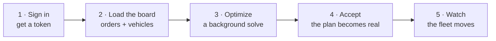
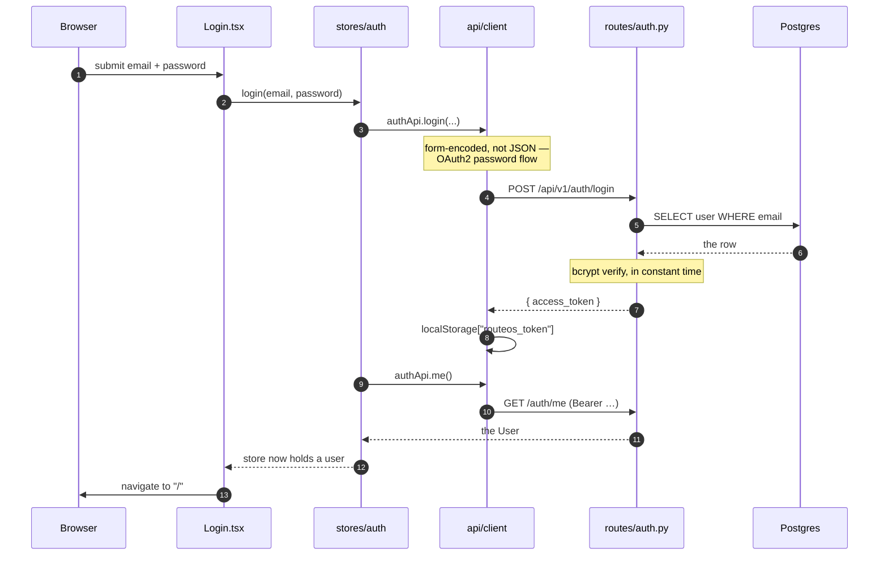
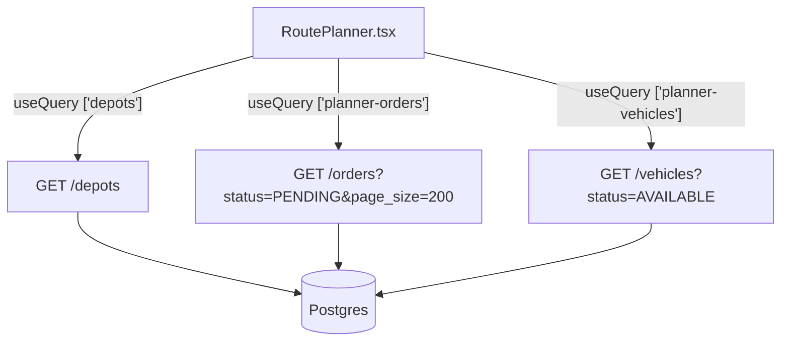
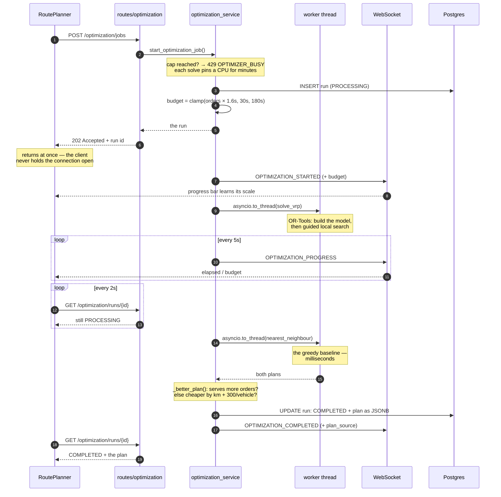
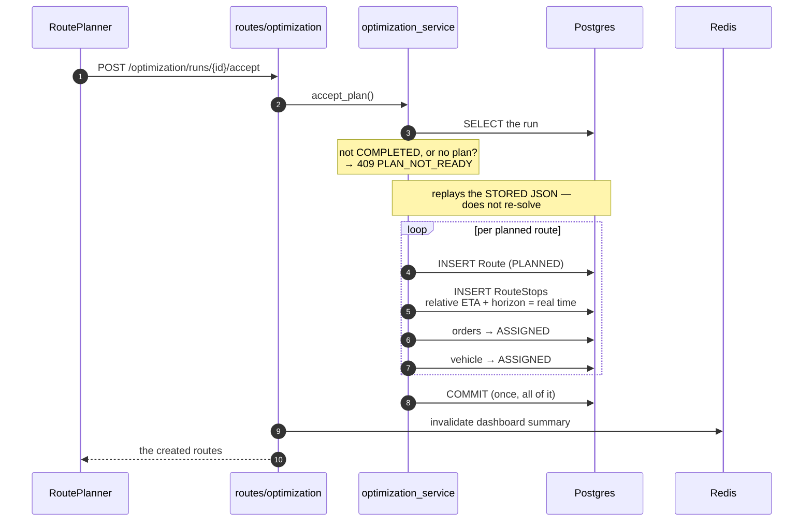
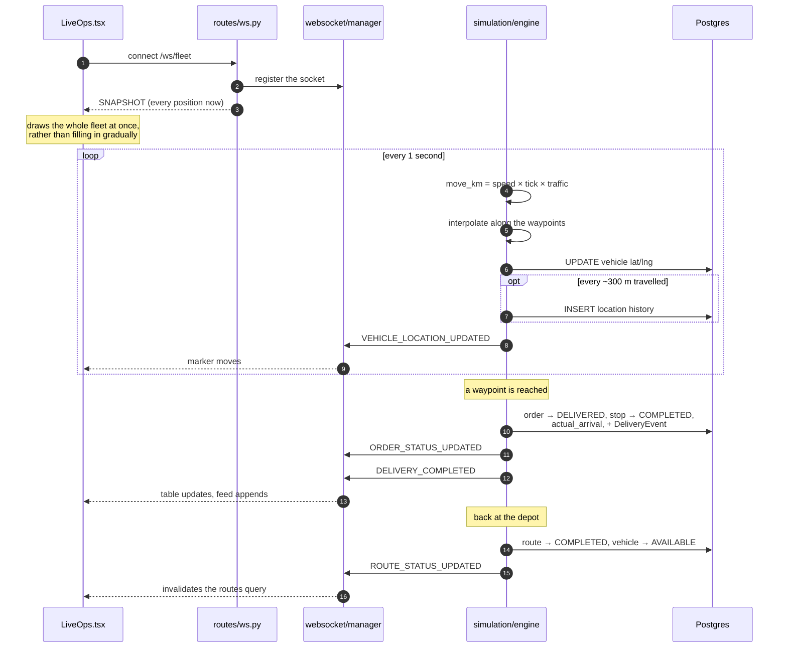
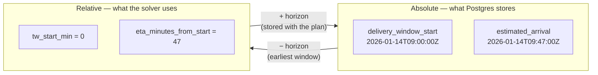

# One click, end to end

Everything else documents a layer. This documents a **journey** — one action
followed all the way from a browser click to a pixel moving on a map, across
both halves of the system.

If you read one architecture document, read this one.

The diagrams here are Mermaid, so they render as pictures on GitHub.

---

## The journey

A dispatcher optimizes a day's deliveries and watches them happen. Five acts:

---

## Act 1 — Signing in

**Why two requests and not one.** Login returns only a token. The user object
comes from a second call, which also proves the token works. That is the same
path `loadUser()` takes on a page refresh — which is why a refresh does not
bounce you to the login screen: `<Protected>` waits on that round trip instead
of treating "no user yet" as "signed out".

The token carries the user's **role**, so a permission check needs no database
lookup for it. But `get_current_user` still re-reads the user on every request —
because a JWT stays valid until it expires, and that `is_active` check is the
only way to revoke access before then.

---

## Act 2 — Loading the board

The Route Planner needs three things, and asks for them independently:

Three separate queries rather than one aggregate call, so each panel loads on
its own and a slow one cannot hold up the others. Each is cached under its own
key.

**`PENDING` and `AVAILABLE` are not just filters — they are rules.** The backend
applies them regardless of what the client asks for, so an order already loaded
on a van cannot be re-planned onto another, and a van already out cannot be
given a second route.

---

## Act 3 — Optimizing

The most interesting act, and the one that spans the most machinery. Note the
solve happens on a **worker thread**, and progress arrives by a **different
channel** than the result.

Three things worth pausing on:

**The thread is not optional.** OR-Tools is CPU-bound C++ that never yields.
Called directly on the event loop it would freeze *every* request — including
`/health` — for the whole budget.

**Two channels, on purpose.** Polling detects *completion*; the WebSocket
carries the *percentage*. The progress fraction is honest because the budget is
a fixed wall-clock limit, so `elapsed / budget` is real rather than a guess.

**Nothing operational has changed yet.** The run row holds a plan as JSON. No
route exists, no order changed status, no vehicle was committed.

---

## Act 4 — Accepting

The single moment the system commits.

**Why it replays JSON instead of re-solving.** The search is time-bounded, so
running it again could legitimately return a *different* plan. A dispatcher must
get the plan they approved.

**Why one commit.** Routes, stops, order statuses and vehicle statuses land
together or not at all. A partial commit could leave orders marked `ASSIGNED`
with no route to be on — an inconsistency nothing would later repair.

**Why Redis is poked here and not in the service.** Accepting changes the
dashboard KPIs immediately, and the summary is cached for 15 seconds. Which
caches a UI keeps is a presentation concern, so the route handler owns it.

---

## Act 5 — Watching

Now the simulation takes over, and the direction of travel reverses: the backend
pushes, the browser listens.

**The rule that makes this trustworthy:** the browser never invents a position.
Every coordinate on that map was written to Postgres first, then broadcast. So
the map, the orders table and the analytics are three views of the same rows —
they cannot disagree. Letting the browser animate between waypoints would break
that, and two open tabs would show different things.

**One event crosses back into the query cache.** A completed route changes the
route *list*, which is server state — so `ROUTE_STATUS_UPDATED` invalidates a
TanStack query rather than being patched into local state.

---

## The two time systems

The single most confusing thing in the codebase, so it is worth stating plainly.

The solver does exact **integer** arithmetic on minutes, so datetimes are
converted once at the boundary and never appear inside the search. The horizon
is saved alongside the plan, which is what lets `accept_plan` turn `47` back
into a real timestamp against the same origin.

Separately, and unrelated despite both sounding like speed:

| Dial | Range | Is |
|---|---|---|
| `speed_multiplier` | 1× – 60× | how fast the **clock** runs — a demo control |
| `speed_factor` | 1.0 / 0.6 / 0.35 / 0.0 | how fast a **vehicle** goes — traffic. Zero is a breakdown |

---

## What each layer contributed

The same journey, as a table — useful when you know *what* you want to change
but not *where*.

| Act | Frontend | Backend | Data |
|---|---|---|---|
| Sign in | `Login.tsx`, `stores/auth` | `routes/auth.py`, `core/security` | `users` |
| Load board | `RoutePlanner` queries | `routes/orders`, `routes/vehicles` | `orders`, `vehicles` |
| Optimize | polling + socket handler | `optimization_service`, `optimization/solver` | `optimization_runs` |
| Accept | `acceptMut` | `accept_plan()` | `routes`, `route_stops`, `orders`, `vehicles` |
| Watch | `LiveOps`, `useFleetSocket` | `simulation/engine`, `websocket/manager` | `vehicle_location_history`, `delivery_events` |

---

## Related

| Document | Covers |
|---|---|
| [`BACKEND-FLOWS.md`](BACKEND-FLOWS.md) | the backend alone, in more depth: state machines, the tick loop |
| [`ARCHITECTURE.md`](ARCHITECTURE.md) | how this would scale to a million deliveries a day |
| [`../GLOSSARY.md`](../GLOSSARY.md) | any term above that needs defining |
| [`../START-HERE.md`](../START-HERE.md) | the orientation page |
