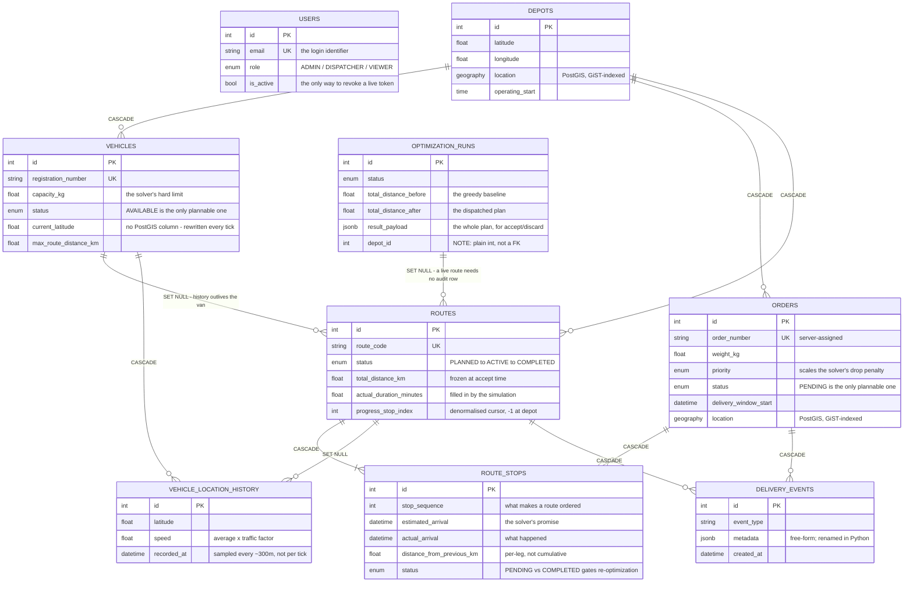

# `app/models/` — the database schema, in Python

One class per table. These classes *are* the schema: Alembic reads them to build
migrations, so a column added here is a column added to Postgres.

Nine tables across six files, plus `enums.py` holding the shared value sets.

---

## Entity-relationship diagram

Nine tables. Relationship labels give the `ON DELETE` rule, because that is
where the design decisions are — see [Delete rules](#delete-rules-are-chosen-not-default)
below.



Three things the diagram makes visible:

- **`users` connects to nothing.** No table has a foreign key to it, so
  deleting an account cannot orphan operational data. Login and permissions
  only.
- **`route_stops` is the hinge**, joining orders to routes while carrying its
  own data — an *association object*, not a plain join table.
- **Every `SET NULL` is deliberate.** Those are the edges where history is
  designed to outlive the thing it happened to.

---

## File index

| File | Tables | Notes |
|---|---|---|
| `enums.py` | — | Nine shared enums. No table, but read this first. |
| `user.py` | `users` | Login + role. Referenced by nothing. |
| `depot.py` | `depots` | The hub. Has a PostGIS `location` column. |
| `vehicle.py` | `vehicles` | The fleet, with live position and capacity. |
| `order.py` | `orders` | A delivery to make. Also PostGIS. |
| `route.py` | `routes`, `route_stops` | A plan and its ordered stops. |
| `optimization.py` | `optimization_runs` | Audit trail of solves. |
| `telemetry.py` | `vehicle_location_history`, `delivery_events` | Append-only history. |

---

## `route_stops` is the interesting table

Orders and routes are many-to-many — but the link carries its own data
(`stop_sequence`, both arrival times, the leg distance), so it cannot be a plain
join table. In ORM terms this is an **association object**.

`stop_sequence` is what makes a route a *route* rather than a set: it is the
visiting order the solver decided on.

```
   route_stops for route 7
   ┌─────┬──────────┬─────────────┬───────────────┬───────────┐
   │ seq │ order_id │ est_arrival │ actual_arrival│  status   │
   ├─────┼──────────┼─────────────┼───────────────┼───────────┤
   │  1  │   1043   │  09:12      │  09:15        │ COMPLETED │
   │  2  │   1101   │  09:34      │  09:31        │ COMPLETED │
   │  3  │   1088   │  09:58      │  NULL         │ PENDING   │  <- next
   │  4  │   1052   │  10:20      │  NULL         │ PENDING   │
   └─────┴──────────┴─────────────┴───────────────┴───────────┘
```

Keeping *estimated* and *actual* arrival side by side is what makes on-time
analysis possible after the fact. And storing only the PENDING/COMPLETED status
per stop is what lets re-optimization rewrite the tail of a route while leaving
completed stops untouched — see `services/simulation_service.py`.

`routes.progress_stop_index` is a denormalised cursor pointing at the last
completed stop. Strictly it is derivable by scanning the stops, but the
simulation reads it on every tick, so it is cached on the parent row.

---

## Delete rules are chosen, not default

Postgres needs to know what happens to children when a parent is deleted. The
choices here follow one principle: **operational rows die with their parent,
historical rows survive it.**

| Delete this | And this happens | Because |
|---|---|---|
| a depot | its vehicles, orders and routes go too (`CASCADE`) | a depot is the root of its own world; none of it means anything without the hub |
| a vehicle | its routes **survive**, with `vehicle_id` set to `NULL` | the route happened. Selling a van must not erase the delivery history |
| a route | its `route_stops` go too (`CASCADE`) | a stop has no meaning without its route |
| an order | its `route_stops` go too (`CASCADE`) | same |
| a vehicle | its location history goes too (`CASCADE`) | breadcrumbs of a vehicle you no longer have |
| a route | its `delivery_events` go too (`CASCADE`) | — |
| an optimization run | routes keep working, `optimization_run_id` → `NULL` | a live route must not depend on its audit record |

The `SET NULL` rows are the deliberate ones: they are how history outlives the
things it happened to.

---

## Enums are stored as strings

```python
status: Mapped[OrderStatus] = mapped_column(SAEnum(OrderStatus, name="order_status"))
```

Each becomes a named Postgres enum type holding `'PENDING'`, `'DELIVERED'` and so
on — not `0`, `1`, `2`. Two reasons: a raw `SELECT` is readable without a lookup
table, and adding a new member later doesn't renumber the existing ones.

Subclassing `str` (`class OrderStatus(str, enum.Enum)`) means a member is *also*
a Python string, so it serialises to JSON with no conversion step.

### `OrderPriority.weight` — behaviour on an enum

```python
LOW: 1,  NORMAL: 2,  HIGH: 4,  URGENT: 8
```

The one enum carrying a method rather than just names. The weights are powers of
two, and they are deliberately *not* linear: the solver multiplies this weight by
its drop penalty, so an URGENT order is eight times more expensive to leave
unassigned than a LOW one. Doubling at each step means a single URGENT order
outranks several LOW ones instead of being averaged away.

This is a good place for it — the priority *ladder* is domain knowledge, so it
belongs next to the priority definition, not buried in the solver.

---

## Two things that look like mistakes

**1. `delivery_events.event_metadata` maps to a column named `metadata`.**

```python
event_metadata: Mapped[...] = mapped_column("metadata", JSONB)
```

Not a typo. `metadata` is already taken on the declarative `Base` (it holds the
table registry), so a Python attribute of that name would collide. The attribute
is renamed; the column keeps the name we actually want in SQL.

**2. `optimization_runs.depot_id` is a plain `Integer`, not a `ForeignKey`.**

Every other depot reference in the schema is a real FK. This one is not, so the
database will not stop you deleting a depot that runs still refer to.

That is an inconsistency rather than a documented decision. The defensible
version of the same intent — *an audit record should outlive the depot it ran
for* — would be a real FK with `ondelete="SET NULL"`, matching how
`routes.optimization_run_id` already handles the same problem. Fixing it needs a
migration, so it is recorded here rather than changed in passing.

---

## Indexes

Beyond the primary keys and the `UNIQUE` constraints on `email`,
`order_number`, `registration_number` and `route_code`:

| Table | Indexed | Serves |
|---|---|---|
| `orders` | `status`, `priority`, `depot_id`, `created_at` | the filter/sort on the orders list, and "pending orders at depot X" — the optimizer's first query |
| `vehicles` | `status`, `home_depot_id` | "available vehicles at depot X" |
| `routes` | `status`, `vehicle_id` | the active-routes board |
| `route_stops` | `route_id` | loading a route's stops |
| `vehicle_location_history` | `vehicle_id`, `recorded_at` | replaying one vehicle's track |
| `delivery_events` | `order_id`, `created_at` | the recent-activity feed |

The PostGIS `location` columns on `depots` and `orders` additionally get **GiST**
indexes — created automatically by GeoAlchemy2's DDL hooks, not written by hand.
A B-tree is useless for "within N km"; GiST is what makes `ST_DWithin` fast.
