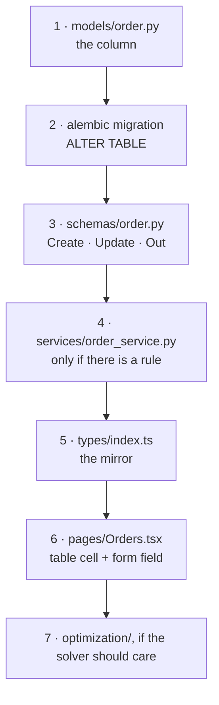

# How to change things

Recipes for the common tasks. Each lists every file you must touch, in
dependency order, because most changes here cross several layers and missing one
fails quietly rather than loudly.

The file lists were traced through the real code, not guessed — the field recipe
follows `weight_kg` through all seven of its files.

---

## Add a field to an existing resource

Say a `fragile` flag on orders. **Seven files, and the order matters** — each
step depends on the one before.



### 1. The column — `backend/app/models/order.py`

```python
fragile: Mapped[bool] = mapped_column(default=False, nullable=False)
```

Give it a default, or existing rows have no value and the migration fails on a
non-empty table.

### 2. The migration

```bash
cd backend
alembic revision --autogenerate -m "add fragile flag to orders"
```

**Read the generated file before running it.** Autogenerate diffs, it does not
read intent — see the rename warning in
[`TROUBLESHOOTING.md`](TROUBLESHOOTING.md). Then:

```bash
alembic upgrade head
```

### 3. The API contract — `backend/app/schemas/order.py`

Three places, and think about each:

```python
class OrderBase(BaseModel):      # may a client SET it on create?
    fragile: bool = False

class OrderUpdate(BaseModel):    # may a client CHANGE it? optional if so
    fragile: bool | None = None

class OrderOut(BaseModel):       # should the API EXPOSE it?
    fragile: bool
```

Leaving it out of `OrderOut` means it never reaches the API — which is the point
of the schema layer. Leaving it out of `OrderBase` means a client cannot set it.

### 4. A rule, if there is one — `backend/app/services/order_service.py`

Only if changing it is conditional ("a fragile order cannot be un-flagged once
assigned"). Raise `APIError(..., status_code=409)`. If there is no rule, skip
this file — the generic update already handles new fields via
`model_dump(exclude_unset=True)`.

### 5. The frontend mirror — `frontend/src/types/index.ts`

```ts
export interface Order {
  fragile: boolean;
}
```

**Nothing enforces this matches the backend.** Get it wrong and TypeScript stays
happy while the value is `undefined` at runtime. This is the step most likely to
be forgotten.

### 6. The UI — `frontend/src/pages/Orders.tsx`

A table cell, and a field in `OrderForm` (plus its `useState` initialiser).

### 7. The solver, if it should affect routing

Only if the field changes the *plan*. That means `optimization/types.py`
(`OrderNode`), the conversion in `optimization_service._execute_run`, and a
constraint in `solver.py`. Read
[`backend/app/optimization/README.md`](../backend/app/optimization/README.md)
first — a new constraint is a real modelling decision, not a field copy.

### Verify

```bash
cd backend && pytest                    # 108 tests (58 without a database)
cd frontend && npm run lint             # tsc --noEmit
```

---

## Add an endpoint

Four files, plus one line that is easy to forget.

| # | File | Do |
|---|---|---|
| 1 | `backend/app/schemas/<resource>.py` | Request and response shapes |
| 2 | `backend/app/services/<resource>_service.py` | **The logic. Not in the handler.** |
| 3 | `backend/app/api/routes/<resource>.py` | Declare, validate, authorize, delegate — four lines |
| 4 | `backend/app/main.py` | `app.include_router(...)` — **only for a new module** |
| 5 | `frontend/src/api/endpoints.ts` | A typed method on the resource's object |

The handler should look like this and no longer:

```python
@router.post("/{id}/archive", response_model=OrderOut)
async def archive(id: int, db: AsyncSession = Depends(get_db), _=Depends(_manage)):
    return await order_service.archive(db, id)
```

**Two traps:**

- **Declare literal paths before parameterised ones.** `/orders/archived` after
  `/orders/{id}` never matches — the path parameter swallows it and returns a
  confusing 422 about a parameter the caller never sent.
- **Step 4 fails silently.** Forget `include_router` and the module imports
  fine, the tests pass, and the endpoint simply does not exist.

---

## Add a screen

Three files.

| # | File | Do |
|---|---|---|
| 1 | `frontend/src/pages/Thing.tsx` | The screen. Copy `Orders.tsx`'s shape. |
| 2 | `frontend/src/App.tsx` | `<Route path="thing" element={<Thing />} />` — inside the guarded parent route, so it is protected automatically |
| 3 | `frontend/src/components/Layout.tsx` | An entry in the `NAV` array |

Follow the established shape or the screen will feel foreign:

```jsx
<PageHeader title="Thing" actions={editable && <button/>} />
{q.isLoading ? <Skeleton/> : empty ? <EmptyState/> : <table/>}
```

Put every filter **in the query key** (`["things", page, status]`) so a filter
change refetches itself, and make writes call `invalidateQueries` rather than
patching the cache. See [`frontend/src/pages/README.md`](../frontend/src/pages/README.md).

---

## Change what the optimizer optimizes

Read [`backend/app/optimization/README.md`](../backend/app/optimization/README.md)
first. Then, by intent:

| I want to… | Change | Note |
|---|---|---|
| trade distance against vehicle count | `VEHICLE_FIXED_COST` in `solver.py` | **Also change `VEHICLE_COST_KM_EQUIVALENT`** in `optimization_service.py`. They are the same policy in two units, and `test_plan_selection.py` fails if they disagree — which is what that test is for |
| make dropping orders more or less acceptable | `BASE_DROP_PENALTY` | Must stay far above any plausible arc cost (~30,000), or the solver abandons far orders to save a few km |
| re-weight priorities | `OrderPriority.weight` in `models/enums.py` | Powers of two on purpose — linear weights let one URGENT be traded for two NORMALs |
| give the search more time | `SOLVER_*` settings in `core/config.py` | No code change. This is the first thing to try when `plan_source` is `"baseline"` |
| add a constraint (volume, driver hours, skills) | a new **dimension** in `solver.py` | The real work. Follow the Capacity dimension as a template |
| use real road distances | `USE_OSRM=true` | Needs a reachable OSRM server; the public demo one is rate-limited |

**Every tunable number lives in `core/config.py`, not in the code that reads
it.** The two exceptions are `BASE_DROP_PENALTY` and `VEHICLE_FIXED_COST`, which
are structural — they only need the right order of magnitude relative to arc
costs, so exposing them would invite breaking the model rather than tuning it.

---

## Add a WebSocket event

| # | Where | Do |
|---|---|---|
| 1 | wherever the thing happens | `await manager.broadcast("MY_EVENT", {...})` |
| 2 | `frontend/src/pages/LiveOps.tsx` | A `case` in the switch |
| 3 | `backend/app/websocket/README.md` | Add it to the catalogue |

**Broadcast after the database write, never before.** Every event in this system
is a fact that already happened, which is what lets a client trust it without
confirming.

The envelope is fixed (`{type, data}`), so an older client ignores a new event
rather than breaking on it. Note `WsEvent.data` is typed `any` — a typo in
`e.data.vehicle_id` will compile.

---

## Add a test

`backend/tests/`. The suite is DB-free, so a new test should be too where
possible:

| Testing | Follow |
|---|---|
| solver behaviour | `test_optimization.py` — assert **properties** (no van overloaded), not exact routes. It is a heuristic; exact answers change between versions and machines |
| plan selection | `test_plan_selection.py` — build `SolveResult`s by hand |
| pure functions | `test_geospatial.py` |
| configuration | `test_config.py` |

**The gap, if you want the highest-value contribution:** there is no test of any
endpoint, any CRUD service, or any of auth. That needs a throwaway database —
and `aiosqlite` is already a dependency, apparently added for exactly this and
never used. The frontend has no tests at all.

---

## Common mistakes

Ordered by how often they bite.

| Mistake | Symptom | Fix |
|---|---|---|
| Forgot `selectinload` | `MissingGreenlet` | Eager-load the relationship |
| Forgot `include_router` | Endpoint 404s, tests pass | One line in `main.py` |
| Forgot `types/index.ts` | Runtime `undefined`, no type error | Mirror the schema |
| Forgot `invalidateQueries` | Stale UI after a write | Invalidate the key |
| Path parameter before a literal | Confusing 422 | Reorder the decorators |
| Business logic in a handler | Handler over ~5 lines | Move it to a service |
| Server data in `useState` | Screen goes stale | Use `useQuery` |
| Tailwind class built at runtime | No styling, no error | Write the class literally |
| Changed a `VITE_*` var | No effect | Rebuild — Vite inlines at build time |

---

## Before you commit

```bash
cd backend  && pytest && python -c "import app.main"
cd frontend && npm run lint && npm run build
```

The backend safety net is 108 tests in two tiers: 58 that need nothing, and
50 more covering the API and business rules that run only when a PostGIS test
database is reachable — see [`../backend/tests/README.md`](../backend/tests/README.md)
for the one-line container command. Without it those skip rather than fail, so a
green run does not always mean the API was exercised. Check the skip count.

Still uncovered: the simulation engine, the WebSocket, the analytics SQL, and
the **entire frontend**, whose only automated check is a typecheck. For anything
in those areas, run it and click through it.
